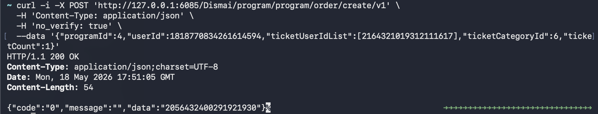
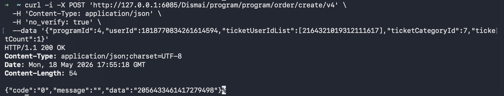

# 260519 后端压测原始记录

本文档用于记录压测前的原始准备过程、接口验证过程、测试数据来源和关键命令。后续正式编写 JMeter/脚本压测方案与压测报告时，以本文档作为事实依据。

## 一、压测前置数据检查：MySQL 基础业务数据

### 测试目标

本步骤不直接测试业务接口，目标是确认 Docker MySQL 初始化后是否已经具备后端压测所需的基础数据，包括：

- 演出数据
- 票档数据
- 座位数据
- 用户数据
- 购票人数据

### 执行命令

```bash
docker exec -it dismai-mysql mysql -uroot -proot -e "
SELECT 'program_0.d_program_0' AS table_name, COUNT(*) AS cnt FROM dismai_program_0.d_program_0;
SELECT 'program_0.d_program_1' AS table_name, COUNT(*) AS cnt FROM dismai_program_0.d_program_1;
SELECT 'program_1.d_program_0' AS table_name, COUNT(*) AS cnt FROM dismai_program_1.d_program_0;
SELECT 'program_1.d_program_1' AS table_name, COUNT(*) AS cnt FROM dismai_program_1.d_program_1;

SELECT 'ticket_category_0' AS table_name, COUNT(*) AS cnt FROM dismai_program_0.d_ticket_category_0;
SELECT 'ticket_category_1' AS table_name, COUNT(*) AS cnt FROM dismai_program_0.d_ticket_category_1;

SELECT 'seat_0' AS table_name, COUNT(*) AS cnt FROM dismai_program_0.d_seat_0;
SELECT 'seat_1' AS table_name, COUNT(*) AS cnt FROM dismai_program_0.d_seat_1;

SELECT 'user_0.d_user_0' AS table_name, COUNT(*) AS cnt FROM dismai_user_0.d_user_0;
SELECT 'user_0.d_user_1' AS table_name, COUNT(*) AS cnt FROM dismai_user_0.d_user_1;
SELECT 'ticket_user_0' AS table_name, COUNT(*) AS cnt FROM dismai_user_0.d_ticket_user_0;
SELECT 'ticket_user_1' AS table_name, COUNT(*) AS cnt FROM dismai_user_0.d_ticket_user_1;
"
```

### 查询结果

| 数据表 | 数量 | 结论 |
| --- | ---: | --- |
| `dismai_program_0.d_program_0` | 13 | 已有演出数据 |
| `dismai_program_0.d_program_1` | 13 | 已有演出数据 |
| `dismai_program_1.d_program_0` | 12 | 已有演出数据 |
| `dismai_program_1.d_program_1` | 11 | 已有演出数据 |
| `dismai_program_0.d_ticket_category_0` | 49 | 已有票档数据 |
| `dismai_program_0.d_ticket_category_1` | 46 | 已有票档数据 |
| `dismai_program_0.d_seat_0` | 1740 | 已有座位数据 |
| `dismai_program_0.d_seat_1` | 7290 | 已有座位数据 |
| `dismai_user_0.d_user_0` | 0 | 当前分片无用户 |
| `dismai_user_0.d_user_1` | 1 | 已有一个初始化用户 |
| `dismai_user_0.d_ticket_user_0` | 0 | 无购票人 |
| `dismai_user_0.d_ticket_user_1` | 0 | 无购票人 |

### 当前结论

Docker MySQL 并不是空库，项目初始化 SQL 已经导入了演出、票档、座位和一个用户数据。当前缺失的是购票人数据，因此暂时不能直接压测创建订单接口，否则订单链路会在用户购票人校验阶段失败。

## 二、压测前置数据检查：查询初始化用户

### 测试目标

本步骤不直接测试业务接口，目标是确认初始化用户的 `userId`，后续创建购票人、创建订单、支付测试均需要使用该用户。

### 执行命令

```bash
docker exec -it dismai-mysql mysql -uroot -proot -e "
SELECT id,mobile,password,status,create_time FROM dismai_user_0.d_user_1;
"
```

### 查询结果

| 字段 | 值 |
| --- | --- |
| `id` | `1818770834261614594` |
| `mobile` | `280a7288b94ca19418b4ed5b710617a8` |
| `password` | `9da6b113c108364ba9524f02624b8255` |
| `status` | `1` |
| `create_time` | `2026-01-22 15:43:35` |

### 当前结论

后续接口测试使用的初始化用户为：

```text
userId = 1818770834261614594
```

## 三、购票人创建接口：`POST /Dismai/user/ticket/user/add`

### 测试目标

本步骤测试购票人创建接口，为后续订单创建压测准备必要的购票人数据。

订单创建接口会校验用户是否存在有效购票人。如果 `d_ticket_user_0` 和 `d_ticket_user_1` 均为空，则下单链路无法完整执行。

### 请求命令

```bash
curl -i -X POST 'http://127.0.0.1:6085/Dismai/user/ticket/user/add' \
  -H 'Content-Type: application/json' \
  -H 'no_verify: true' \
  --data '{"userId":1818770834261614594,"relName":"压测用户1","idType":1,"idNumber":"110101199001010011"}'
```

### 响应结果

```http
HTTP/1.1 200 OK
Content-Type: application/json

{"code":"0","message":"","data":null}
```

### 落库确认命令

```bash
docker exec -it dismai-mysql mysql -uroot -proot -e "
SELECT * FROM dismai_user_0.d_ticket_user_0;
SELECT * FROM dismai_user_0.d_ticket_user_1;
"
```

### 落库结果

| 字段 | 值 |
| --- | --- |
| `id` | `2164321019312111617` |
| `user_id` | `1818770834261614594` |
| `rel_name` | `????1` |
| `id_type` | `1` |
| `id_number` | `110101199001010011` |
| `create_time` | `2026-05-19 01:39:48` |
| `edit_time` | `2026-05-19 01:39:48` |
| `status` | `1` |

### 当前结论

购票人创建成功。后续订单创建接口测试可使用以下测试身份：

```text
userId = 1818770834261614594
ticketUserId = 2164321019312111617
idNumber = 110101199001010011
```

`rel_name` 显示为 `????1`，属于当前终端或容器字符集显示问题，不影响后续订单链路测试。后续核心校验主要依赖 `ticketUserId`、`userId` 和 `idNumber`。

## 四、创建订单接口前置数据筛选：非选座演出票档

### 测试目标

本步骤不直接请求创建订单接口，目标是筛选可用于创建订单接口测试的非选座演出和票档数据。

优先选择 `permit_choose_seat = 0` 的票档，是为了先避开座位选择参数，降低首次接口验证复杂度。

### 执行命令

```bash
docker exec -it dismai-mysql mysql -uroot -proot -e "
SELECT p.id AS program_id,
       p.title,
       p.permit_choose_seat,
       tc.id AS ticket_category_id,
       tc.introduce AS ticket_name,
       tc.price,
       tc.remain_number,
       tc.total_number
FROM dismai_program_0.d_program_0 p
JOIN dismai_program_0.d_ticket_category_0 tc ON tc.program_id = p.id
WHERE p.status = 1
  AND tc.status = 1
  AND p.permit_choose_seat = 0
  AND tc.remain_number > 0
LIMIT 10;
"
```

### 查询结果

| `program_id` | `title` | `permit_choose_seat` | `ticket_category_id` | `ticket_name` | `price` | `remain_number` | `total_number` |
| ---: | --- | ---: | ---: | --- | ---: | ---: | ---: |
| 4 | 于文文「魔方视界」巡回演唱会 | 0 | 6 | 普通票 | 199 | 20 | 20 |
| 4 | 于文文「魔方视界」巡回演唱会 | 0 | 7 | VIP票 | 299 | 20 | 20 |
| 8 | 【挪威的森林】伍佰魔性情歌之夜演唱会\|从“突然的自我”听到“伤心太平洋” | 0 | 10 | 普通票 | 150 | 30 | 30 |
| 8 | 【挪威的森林】伍佰魔性情歌之夜演唱会\|从“突然的自我”听到“伤心太平洋” | 0 | 11 | VIP票 | 219 | 20 | 20 |
| 12 | 林志炫《我忘了我已老去》巡回演唱会 | 0 | 14 | 普通票 | 188 | 30 | 30 |
| 12 | 林志炫《我忘了我已老去》巡回演唱会 | 0 | 15 | VIP票 | 299 | 20 | 20 |
| 16 | 千禧隧道的「十年」”——《断桥残雪》《十年》《青花瓷》经典名曲live现场 | 0 | 18 | 普通票 | 269 | 30 | 30 |
| 16 | 千禧隧道的「十年」”——《断桥残雪》《十年》《青花瓷》经典名曲live现场 | 0 | 19 | VIP票 | 319 | 20 | 20 |
| 20 | 夜猫俱乐部「青春回忆KTV」华流金曲 全场畅饮！！ | 0 | 22 | 普通票 | 499 | 30 | 30 |
| 20 | 夜猫俱乐部「青春回忆KTV」华流金曲 全场畅饮！！ | 0 | 23 | VIP票 | 599 | 20 | 20 |

### 当前结论

已筛选到可用于创建订单接口测试的非选座票档。下一步单次接口验证可先使用以下测试数据：

```text
programId = 4
ticketCategoryId = 6
ticketCount = 1
userId = 1818770834261614594
ticketUserId = 2164321019312111617
```

## 五、创建订单接口：`POST /Dismai/program/program/order/create/v1`

### 测试目标

本步骤测试创建订单 V1 接口的单次请求链路。V1 创建订单使用同步 RPC 调用订单服务，适合作为正式压测前的基础链路验证。

### 请求命令

```bash
curl -i -X POST 'http://127.0.0.1:6085/Dismai/program/program/order/create/v1' \
  -H 'Content-Type: application/json' \
  -H 'no_verify: true' \
  --data '{"programId":4,"userId":1818770834261614594,"ticketUserIdList":[2164321019312111617],"ticketCategoryId":6,"ticketCount":1}'
```

### 响应结果

```http
HTTP/1.1 200 OK
Content-Type: application/json;charset=UTF-8

{"code":"-100","message":"系统错误，请稍后重试!","data":null}
```

### 后端异常

`order-service` 日志显示创建订单购票人明细时写库失败：

```text
Unknown column 'id_number' in 'field list'
```

异常位置：

```text
com.dismai.mapper.OrderTicketUserMapper.insert
com.dismai.service.OrderTicketUserService.saveBatch
com.dismai.service.OrderService.create(OrderService.java:153)
```

### 当前结论

创建订单请求已经成功到达 `program-service` 并继续 RPC 调用了 `order-service`。失败点位于订单服务落库阶段：代码写入 `d_order_ticket_user` 逻辑表时包含 `id_number` 字段，但当前 MySQL 运行库中的订单购票人明细物理表缺少该字段。

该问题属于订单服务实体字段与当前运行数据库表结构不一致，暂时不是网关、签名、购票人、票档筛选问题。

### 表结构确认命令

```bash
docker exec -it dismai-mysql mysql -uroot -proot -e "
SHOW COLUMNS FROM dismai_order_0.d_order_ticket_user_0 LIKE 'id_number';
SHOW COLUMNS FROM dismai_order_0.d_order_ticket_user_1 LIKE 'id_number';
SHOW COLUMNS FROM dismai_order_0.d_order_ticket_user_2 LIKE 'id_number';
SHOW COLUMNS FROM dismai_order_0.d_order_ticket_user_3 LIKE 'id_number';

SHOW COLUMNS FROM dismai_order_1.d_order_ticket_user_0 LIKE 'id_number';
SHOW COLUMNS FROM dismai_order_1.d_order_ticket_user_1 LIKE 'id_number';
SHOW COLUMNS FROM dismai_order_1.d_order_ticket_user_2 LIKE 'id_number';
SHOW COLUMNS FROM dismai_order_1.d_order_ticket_user_3 LIKE 'id_number';
"
```

### 表结构确认结果

初次查询无输出，确认当前 8 张订单购票人明细物理表均缺少 `id_number` 字段。

### 临时修复命令

```bash
docker exec -it dismai-mysql mysql -uroot -proot -e "
ALTER TABLE dismai_order_0.d_order_ticket_user_0 ADD COLUMN id_number varchar(64) DEFAULT NULL COMMENT '购票人证件号码' AFTER ticket_user_id;
ALTER TABLE dismai_order_0.d_order_ticket_user_1 ADD COLUMN id_number varchar(64) DEFAULT NULL COMMENT '购票人证件号码' AFTER ticket_user_id;
ALTER TABLE dismai_order_0.d_order_ticket_user_2 ADD COLUMN id_number varchar(64) DEFAULT NULL COMMENT '购票人证件号码' AFTER ticket_user_id;
ALTER TABLE dismai_order_0.d_order_ticket_user_3 ADD COLUMN id_number varchar(64) DEFAULT NULL COMMENT '购票人证件号码' AFTER ticket_user_id;

ALTER TABLE dismai_order_1.d_order_ticket_user_0 ADD COLUMN id_number varchar(64) DEFAULT NULL COMMENT '购票人证件号码' AFTER ticket_user_id;
ALTER TABLE dismai_order_1.d_order_ticket_user_1 ADD COLUMN id_number varchar(64) DEFAULT NULL COMMENT '购票人证件号码' AFTER ticket_user_id;
ALTER TABLE dismai_order_1.d_order_ticket_user_2 ADD COLUMN id_number varchar(64) DEFAULT NULL COMMENT '购票人证件号码' AFTER ticket_user_id;
ALTER TABLE dismai_order_1.d_order_ticket_user_3 ADD COLUMN id_number varchar(64) DEFAULT NULL COMMENT '购票人证件号码' AFTER ticket_user_id;
"
```

### 修复后确认命令

```bash
docker exec -it dismai-mysql mysql -uroot -proot -e "
SHOW COLUMNS FROM dismai_order_0.d_order_ticket_user_0 LIKE 'id_number';
SHOW COLUMNS FROM dismai_order_1.d_order_ticket_user_0 LIKE 'id_number';
"
```

### 修复后确认结果

```text
Field     Type         Null  Key  Default  Extra
id_number varchar(64) YES        NULL
```

### 二次请求命令

```bash
curl -i -X POST 'http://127.0.0.1:6085/Dismai/program/program/order/create/v1' \
  -H 'Content-Type: application/json' \
  -H 'no_verify: true' \
  --data '{"programId":4,"userId":1818770834261614594,"ticketUserIdList":[2164321019312111617],"ticketCategoryId":6,"ticketCount":1}'
```

### 二次响应结果

```http
HTTP/1.1 200 OK
Content-Type: application/json;charset=UTF-8

{"code":"0","message":"","data":"2056432400291921930"}
```

### 访问成功截图



### 当前结论

创建订单 V1 接口单次链路已打通，生成订单号：

```text
orderNumber = 2056432400291921930
```

### 落库确认命令

```bash
docker exec -it dismai-mysql mysql -uroot -proot -e "
SELECT * FROM dismai_order_0.d_order_0 WHERE order_number = 2056432400291921930;
SELECT * FROM dismai_order_0.d_order_1 WHERE order_number = 2056432400291921930;
SELECT * FROM dismai_order_0.d_order_2 WHERE order_number = 2056432400291921930;
SELECT * FROM dismai_order_0.d_order_3 WHERE order_number = 2056432400291921930;

SELECT * FROM dismai_order_1.d_order_0 WHERE order_number = 2056432400291921930;
SELECT * FROM dismai_order_1.d_order_1 WHERE order_number = 2056432400291921930;
SELECT * FROM dismai_order_1.d_order_2 WHERE order_number = 2056432400291921930;
SELECT * FROM dismai_order_1.d_order_3 WHERE order_number = 2056432400291921930;

SELECT * FROM dismai_order_0.d_order_ticket_user_0 WHERE order_number = 2056432400291921930;
SELECT * FROM dismai_order_0.d_order_ticket_user_1 WHERE order_number = 2056432400291921930;
SELECT * FROM dismai_order_0.d_order_ticket_user_2 WHERE order_number = 2056432400291921930;
SELECT * FROM dismai_order_0.d_order_ticket_user_3 WHERE order_number = 2056432400291921930;

SELECT * FROM dismai_order_1.d_order_ticket_user_0 WHERE order_number = 2056432400291921930;
SELECT * FROM dismai_order_1.d_order_ticket_user_1 WHERE order_number = 2056432400291921930;
SELECT * FROM dismai_order_1.d_order_ticket_user_2 WHERE order_number = 2056432400291921930;
SELECT * FROM dismai_order_1.d_order_ticket_user_3 WHERE order_number = 2056432400291921930;
"
```

### 落库确认结果

订单主表存在记录：

| 字段 | 值 |
| --- | --- |
| `id` | `2056432400343363585` |
| `order_number` | `2056432400291921930` |
| `program_id` | `4` |
| `user_id` | `1818770834261614594` |
| `program_title` | 于文文「魔方视界」巡回演唱会 |
| `program_place` | MAO Livehouse北京 |
| `program_show_time` | `2026-06-20 19:00:00` |
| `program_permit_choose_seat` | `0` |
| `order_price` | `199` |
| `order_status` | `1` |
| `create_order_time` | `2026-05-19 01:51:05` |

订单购票人明细表存在记录：

| 字段 | 值 |
| --- | --- |
| `id` | `2164320950592618497` |
| `order_number` | `2056432400291921930` |
| `program_id` | `4` |
| `user_id` | `1818770834261614594` |
| `ticket_user_id` | `2164321019312111617` |
| `id_number` | `1101**********0011` |
| `seat_id` | `81` |
| `ticket_category_id` | `6` |
| `order_price` | `199` |
| `order_status` | `1` |
| `create_order_time` | `2026-05-19 01:51:05` |

### 当前结论

创建订单 V1 接口已完成从 `gateway-service` 到 `program-service`，再到 `order-service` 的完整链路验证。订单主表和订单购票人明细表均成功落库，订单状态为未支付。

## 六、创建订单接口：`POST /Dismai/program/program/order/create/v4`

### 测试目标

本步骤测试创建订单 V4 接口的单次请求链路。V4 创建订单使用 MQ 异步创建订单，是后续高并发压测更贴近核心秒杀链路的接口版本。

### 请求命令

```bash
curl -i -X POST 'http://127.0.0.1:6085/Dismai/program/program/order/create/v4' \
  -H 'Content-Type: application/json' \
  -H 'no_verify: true' \
  --data '{"programId":4,"userId":1818770834261614594,"ticketUserIdList":[2164321019312111617],"ticketCategoryId":7,"ticketCount":1}'
```

### 响应结果

```http
HTTP/1.1 200 OK
Content-Type: application/json;charset=UTF-8

{"code":"0","message":"","data":"2056433461417279498"}
```

### 访问成功截图



### 落库确认命令

```bash
docker exec -it dismai-mysql mysql -uroot -proot -e "
SELECT * FROM dismai_order_0.d_order_0 WHERE order_number = 2056433461417279498;
SELECT * FROM dismai_order_0.d_order_1 WHERE order_number = 2056433461417279498;
SELECT * FROM dismai_order_0.d_order_2 WHERE order_number = 2056433461417279498;
SELECT * FROM dismai_order_0.d_order_3 WHERE order_number = 2056433461417279498;

SELECT * FROM dismai_order_1.d_order_0 WHERE order_number = 2056433461417279498;
SELECT * FROM dismai_order_1.d_order_1 WHERE order_number = 2056433461417279498;
SELECT * FROM dismai_order_1.d_order_2 WHERE order_number = 2056433461417279498;
SELECT * FROM dismai_order_1.d_order_3 WHERE order_number = 2056433461417279498;
"
```

### 落库确认结果

订单主表存在记录：

| 字段 | 值 |
| --- | --- |
| `id` | `2056433463221940226` |
| `order_number` | `2056433461417279498` |
| `program_id` | `4` |
| `user_id` | `1818770834261614594` |
| `program_title` | 于文文「魔方视界」巡回演唱会 |
| `program_place` | MAO Livehouse北京 |
| `program_show_time` | `2026-06-20 19:00:00` |
| `program_permit_choose_seat` | `0` |
| `order_price` | `299` |
| `order_status` | `1` |
| `create_order_time` | `2026-05-19 01:55:18` |

### 当前结论

创建订单 V4 接口单次链路已打通，生成订单号：

```text
orderNumber = 2056433461417279498
```

订单主表成功落库，说明 V4 链路中的 MQ 发送与订单服务消费处理已成功完成。该接口可作为后续创建订单高并发压测的主要入口。
