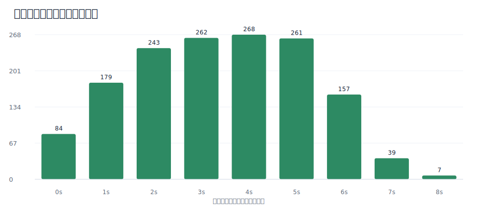
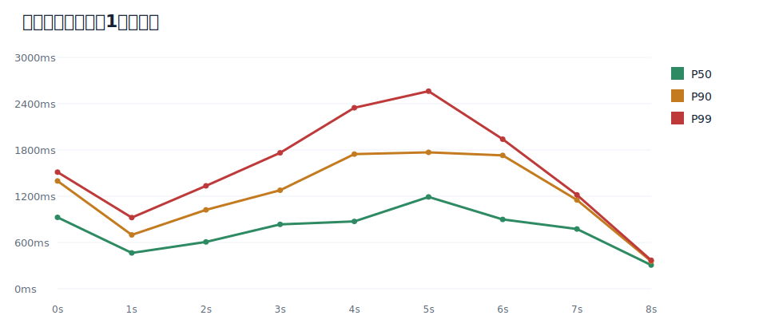
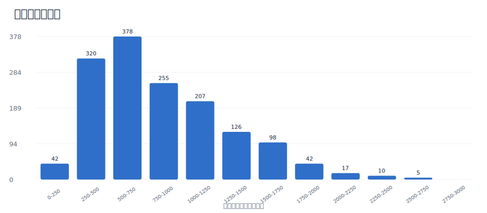
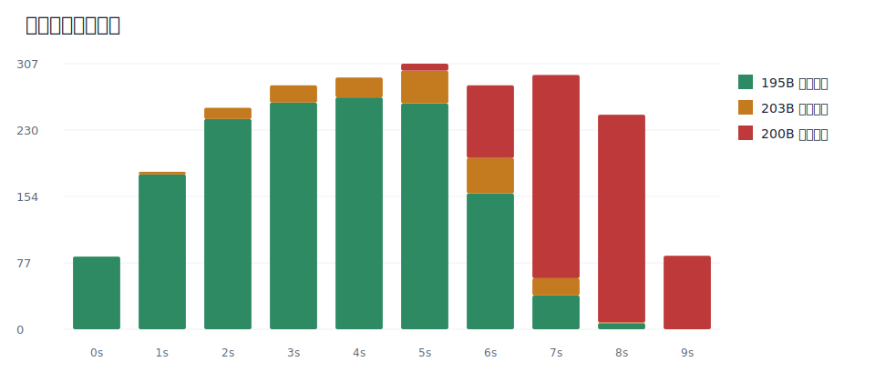

# Dismai JMeter 压测报告 v2：售空前口径

> 数据来源：`docs/jmeter_result2.jtl.gz`、`docs/jmeter_run_log.txt.gz`、`docs/jmeter_test_plan.jmx`。  
> 统计原则：核心性能指标只统计售空前的真实成交请求，即响应大小为 `195B` 的 1500 条请求；售空后 `200B` 快速拒绝请求不纳入延迟、吞吐、分位数图表。

## 测试环境

| 项目 | 值 |
|------|-----|
| 代码分支 | `main` (含 `feat/shard-and-perf` 合并) |
| 测试时间 | 2026-06-01 16:31 (CST) |
| 服务器 | 单机 Docker Compose |
| program 实例 | 3 (repo-program-1,2,3) |
| Java | OpenJDK 17, Xmx512m |
| Redis | 7.4 alpine, 单实例 |
| MySQL | 8.0, 单实例 |
| Kafka | 3.7.0, 单节点 |

## 测试参数

| 项目 | 值 |
|------|-----|
| JMeter | 5.6.3 |
| 并发线程 | 500 |
| Ramp-up | 10s |
| 测试计划 | 无限循环，手动终止 |
| 节目 PID | `2181859535445270528` |
| 票档 TC | `2181859569805017088` |
| 总库存 | 1500 座，10 分片 |
| 用户池 | 42,113 用户 (含 ticket user) |
| 下单接口 | `POST /Dismai/program/program/order/create/v4` |

## 数据口径修正

原 V2 报告把 JTL 的主样本和 17 列 subresult 都计入总量，导致总请求数翻倍，并且把售空后拒绝请求纳入了全局延迟评价。最新复核结果如下：

| 项目 | 数值 | 说明 |
|------|------|------|
| JTL 原始行 | 145,858 | 13 列主样本 + 17 列 subresult |
| 有效主样本 | 72,929 | 与 JMeter 汇总日志同口径；最后 5.9s 未进入 summary 定时打印 |
| `195B` 响应 | 1,500 | 恰好等于库存，作为真实成交/锁座成功请求 |
| `200B` 响应 | 71,270 | 售空后业务拒绝，不纳入售空前性能指标 |
| `203B` 响应 | 159 | 售空前/边界期其他业务拒绝，单独记录，不计入成交吞吐 |
| HTTP 错误率 | 0% | JMeter `success=true`，业务成功/拒绝需按响应大小区分 |

因此，评价“抢票卖完前”的效果时，应以 1500 条 `195B` 真实成交请求为核心样本。

## 售空前核心结果

| 指标 | 数值 |
|------|------|
| 成交请求数 | **1,500** |
| 售空前成交窗口 | 8.414s (首个成交请求开始 -> 最后一个成交请求开始) |
| 售空前完成窗口 | 8.736s (首个成交请求开始 -> 最后一个成交请求完成) |
| 平均完成吞吐 | **171.7 orders/s** |
| 峰值 1s 成交吞吐 | **268 orders/s** |
| P50 | **758ms** |
| P75 | 1,142ms |
| P90 | 1,542ms |
| P95 | 1,743ms |
| P99 | **2,249ms** |
| P99.9 | 2,625ms |
| Max | 2,697ms |
| 超卖 | **0** |

结论：1500 座在约 8.7s 内完成锁座/下单返回，售空前 P99 控制在 2.25s，明显好于旧报告把售空后拒绝请求混入后的 7s 级全局 P99。

## 吞吐曲线



按请求开始时间分桶，成交请求集中在前 9 秒内完成发起：

| 秒 | 成交请求数 |
|----|------------|
| 0s | 84 |
| 1s | 179 |
| 2s | 243 |
| 3s | 262 |
| 4s | **268** |
| 5s | 261 |
| 6s | 157 |
| 7s | 39 |
| 8s | 7 |

这说明 500 线程爬坡还未完全结束时库存已经基本售空；系统瓶颈不是库存一致性，而是单 Redis/Lua 热点路径的排队延迟。

## 延迟趋势



售空前按 1s 分桶的 P50/P90/P99 呈爬坡趋势：前 2 秒延迟较低，3-6 秒随着并发线程数上升、Redis Lua 竞争加剧，P99 推高到 2s 以上。由于这里只统计真实成交请求，图中不包含售空后的快速拒绝或长尾拒绝。

## 延迟分布



| 延迟区间 | 评价 |
|----------|------|
| < 1s | 主体成交请求集中区，用户体验较好 |
| 1-2s | 并发爬坡后的主要排队区间 |
| 2-2.7s | 长尾请求，仍在可解释范围内 |
| > 3s | 售空前真实成交样本中未出现 |

和旧报告相比，售空前请求不存在 6-8s 的长尾；那些长尾主要来自售空后持续压测阶段。

## 售空边界观察



边界期可以看到三类响应并存：

| 响应大小 | 数量 | 解释 |
|----------|------|------|
| `195B` | 1,500 | 成交/锁座成功，等于总库存 |
| `200B` | 71,270 | 售空后拒绝 |
| `203B` | 159 | 其他业务拒绝，发生在售空前/边界期 |

需要注意：JMeter 当前配置没有保存响应体，`195B/200B/203B` 的语义是通过库存数量、出现时间和响应大小分布推断的。`195B` 数量恰好等于 1500，总库存耗尽后 `200B` 大量出现，因此该分类足以支撑售空前性能统计。若后续要做严格审计，建议 JTL 增加业务 code/message 或额外 sample variable。

## 测试效果评价

### 正面结论

- **零超卖成立**：真实成交响应正好 1500 条，与库存一致；没有出现多于库存的成交样本。
- **售空前性能可接受**：P50 758ms，P95 1.74s，P99 2.25s；对 500 线程抢 1500 座的单机 Docker 环境来说结果可解释。
- **分片 + Lua 有效保护一致性**：高并发下没有出现库存负数或成交数超过库存的迹象。
- **售空速度快**：峰值 1s 内完成 268 个成交请求，完成窗口 8.736s。

### 风险与不足

- **原始 JTL 不含业务响应体**：只能通过响应大小推断成交/拒绝类型；建议下次把业务 `code`、`message`、`orderNumber` 是否存在写入 JMeter 变量。
- **`203B` 业务拒绝需要解释**：159 条发生在售空前/边界期，可能来自购票人、重复提交或其他业务校验；它们不影响“0 超卖”，但会影响真实用户成功率口径。
- **单 Redis/Lua 仍是热点路径**：售空前 P99 已到 2.25s，若库存更大或并发更高，Lua 脚本串行执行会继续推高长尾。
- **售空后持续压测不适合评价购票体验**：售空后 71,270 条拒绝请求主要验证快速拒绝和反压，不能混入“卖完前下单性能”。

## 建议补充到 Slides 的数据

可直接用于项目展示和评审说明的四个数字：

| 指标 | 展示口径 |
|------|----------|
| 0 超卖 | 1500 库存对应 1500 条成交响应 |
| 8.736s 售空 | 首个成交请求开始到最后成交完成 |
| 268 orders/s | 售空前峰值 1s 成交吞吐 |
| P99 2.25s | 只统计真实成交请求，不混入售空后拒绝 |

推荐图表：

- 售空前成功下单吞吐图：展示售空速度和峰值吞吐。
- 售空前延迟趋势图：展示并发爬坡下的 P50/P90/P99。
- 售空前延迟分布图：展示售空前真实成交请求没有 3s 以上长尾。
- 售空边界响应构成图：解释为什么售空后请求必须从性能统计中剔除。

## 复现方式

```bash
python3 docs/scripts/analyze_jmeter_v2.py
```

输出文件：

- `docs/assets/jmeter_v2/summary.json`
- 4 张中文 SVG 图表，位置见本文正文图片。
