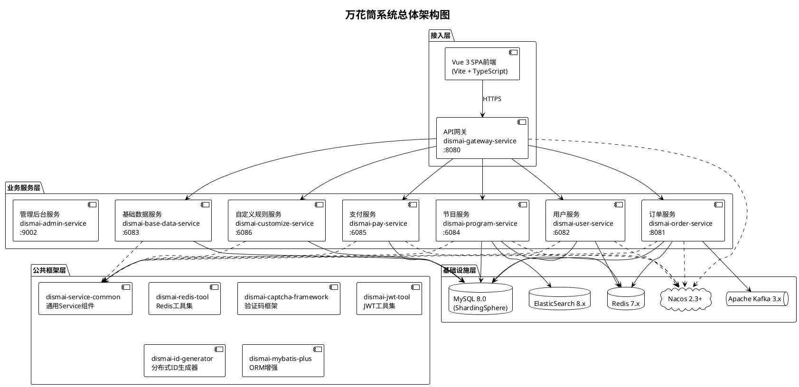
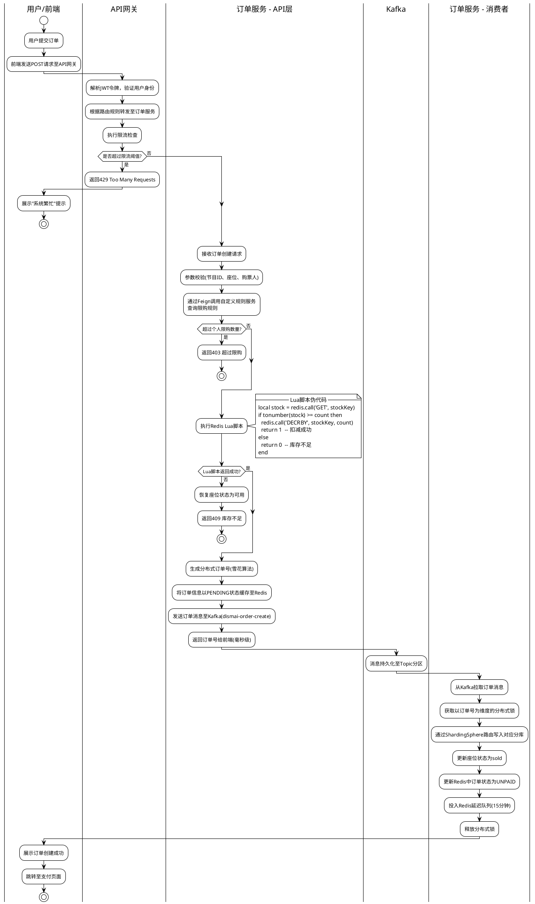
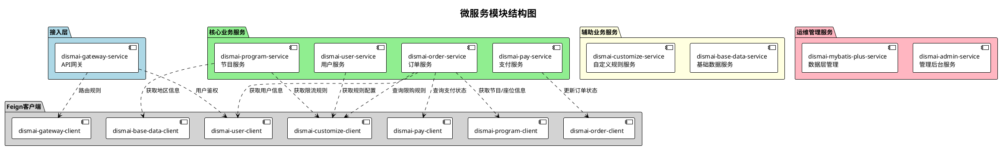
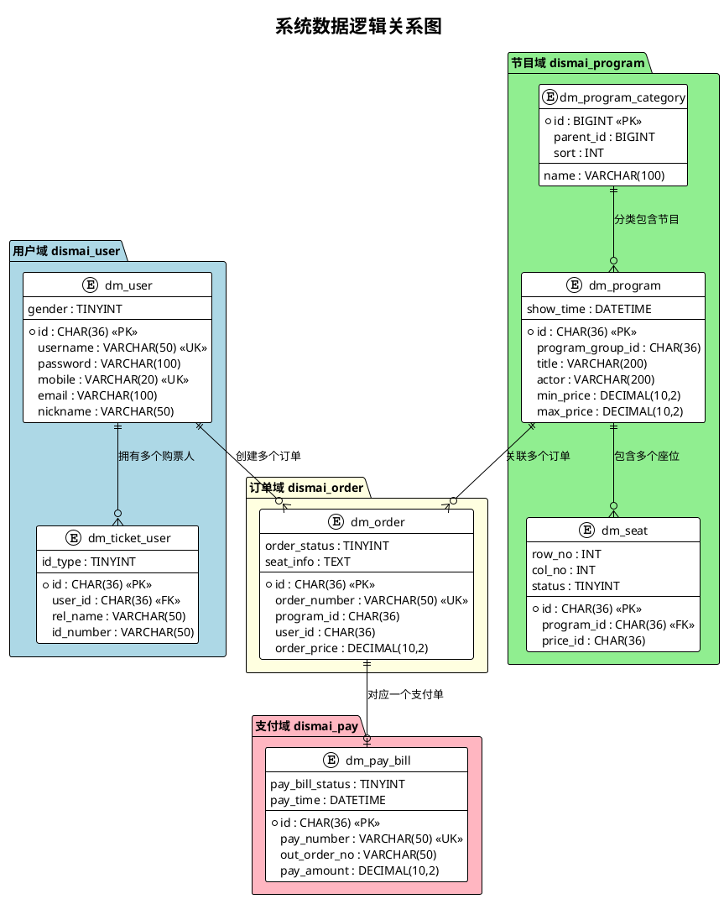

# 万花筒高并发在线票务服务系统
# 概要设计说明书
---

| 项目 | 内容 |
| --- | --- |
| 案卷号 | DISMAI-HLD-2026-001 |
| 日期 | 2026年5月 |
| 项目名称 | 万花筒高并发在线票务服务系统 |
| 项目标识 | Dismai Ticketing System |
| 编制 | 万花筒开发团队 |
| 审核 | — |
| 批准 | — |


---

**修改历史记录**

| 版本 | 日期 | 修改说明 | 修改人 |
| --- | --- | --- | --- |
| V1.0 | 2026-05 | 初始版本，完成全部概要设计 | 万花筒开发团队 |


---

## 目录
+ [1 引言](#1-引言)
    - [1.1 编写目的](#11-编写目的)
    - [1.2 范围](#12-范围)
    - [1.3 定义](#13-定义)
    - [1.4 参考资料](#14-参考资料)
+ [2 总体设计](#2-总体设计)
    - [2.1 需求规定](#21-需求规定)
    - [2.2 运行环境](#22-运行环境)
    - [2.3 基本设计概念和处理流程](#23-基本设计概念和处理流程)
    - [2.4 结构](#24-结构)
    - [2.5 功能需求与程序的关系](#25-功能需求与程序的关系)
    - [2.6 人工处理过程](#26-人工处理过程)
    - [2.7 尚未解决的问题](#27-尚未解决的问题)
+ [3 接口设计](#3-接口设计)
    - [3.1 用户接口](#31-用户接口)
    - [3.2 外部接口](#32-外部接口)
    - [3.3 内部接口](#33-内部接口)
+ [4 运行设计](#4-运行设计)
    - [4.1 运行模块组合](#41-运行模块组合)
    - [4.2 运行控制](#42-运行控制)
    - [4.3 运行时间](#43-运行时间)
+ [5 系统数据结构设计](#5-系统数据结构设计)
    - [5.1 逻辑结构设计要点](#51-逻辑结构设计要点)
    - [5.2 物理结构设计要点](#52-物理结构设计要点)
    - [5.3 数据结构与程序的关系](#53-数据结构与程序的关系)
+ [6 系统出错处理设计](#6-系统出错处理设计)
    - [6.1 出错信息](#61-出错信息)
    - [6.2 补救措施](#62-补救措施)
    - [6.3 系统维护设计](#63-系统维护设计)

---

## 1 引言
### 1.1 编写目的
本文档是"万花筒高并发在线票务服务系统"（以下简称"万花筒系统"）的概要设计说明书。编写本文档的目的在于，对万花筒系统的总体架构设计、模块划分策略、接口定义、数据结构设计以及出错处理机制进行完整的阐述，为后续的详细设计和编码实现阶段提供顶层架构指导和设计依据。

本文档面向的读者包括：系统架构师——用于评审整体架构的合理性和可扩展性；后端开发工程师——用于理解各微服务模块的职责边界和交互协议；前端开发工程师——用于明确前后端接口的约定和数据格式；测试工程师——用于设计集成测试和系统测试的测试策略；运维工程师——用于制定部署方案和运维监控策略。本文档同时也作为项目知识传承的重要组成部分，供后续维护团队参考。

### 1.2 范围
万花筒高并发在线票务服务系统是一个基于微服务架构的在线票务交易平台，为终端用户提供演出节目的浏览、搜索、选座、订票、支付和订单管理等全流程服务。系统将要完成的核心目标包括：在高并发场景下（热门节目开票高峰）保证订单创建的正确性和高吞吐量；通过微服务架构实现各业务域的独立演进和弹性伸缩；通过多级缓存、异步消息处理和分库分表等技术手段满足性能指标要求。

系统的功能范围覆盖用户域（注册、登录、信息管理、购票人管理）、节目域（浏览、搜索、详情、选座）、交易域（下单、支付、订单管理）和管理域（基础数据、规则配置、监控）四个业务领域。

### 1.3 定义
本文档中使用的术语和缩略语的定义与《万花筒高并发在线票务服务系统软件需求说明书》（DISMAI-SRS-2026-001）中的定义保持一致，此处列出本文档中新增使用的设计相关术语。

| 术语/缩写 | 含义说明 |
| --- | --- |
| API Gateway | API网关，系统的统一流量入口，负责请求路由、身份鉴权、限流和灰度发布 |
| Cache-Aside | 旁路缓存模式，读取时先查缓存再查数据库，写入时先更新数据库再删除缓存 |
| L1/L2缓存 | 两级缓存架构，L1为进程内本地缓存（Caffeine），L2为Redis分布式缓存 |
| 分布式ID | 基于改良雪花算法生成的全局唯一标识符，用作各业务表的主键 |
| Lua脚本 | Redis服务端执行的脚本语言，用于实现原子性的库存检查与扣减操作 |
| 延迟队列 | 基于Redis的Sorted Set实现的延时消费队列，用于订单超时自动取消 |
| 死信队列 | 存储消费失败且已超过最大重试次数的消息的特殊队列 |
| 蓝绿部署 | 一种部署策略，同时维护两套完整的生产环境，切换流量实现零停机发布 |


### 1.4 参考资料
| 序号 | 文献标题 | 编号/版本 |
| --- | --- | --- |
| 1 | 万花筒系统软件需求说明书 | DISMAI-SRS-2026-001 V1.0 |
| 2 | 计算机软件需求说明编制指南 | GB/T 9385-2008 |
| 3 | 概要设计说明书编写规范 | GB/T 8567-2006 |
| 4 | Spring Boot Reference Documentation | 3.3.0 |
| 5 | Spring Cloud Documentation | 2023.0.2 |
| 6 | Apache ShardingSphere User Manual | 5.x |
| 7 | Apache Kafka Documentation | 3.x |
| 8 | ElasticSearch Reference | 8.x |
| 9 | Redisson Reference Guide | Latest |


---

## 2 总体设计
### 2.1 需求规定
万花筒系统需要实现的全部输入数据和输出数据的类型及特征在《软件需求说明书》中已有详尽描述，此处仅就对概要设计有直接影响的核心需求进行说明。

在功能方面，系统需要实现完整的票务交易闭环，涵盖用户管理、节目展示与搜索、座位选择、订单创建、支付处理和订单生命周期管理。其中，订单创建功能在架构设计上的权重最高，因为它是高并发场景下最容易出现数据一致性问题（超卖）和性能瓶颈的环节。

在性能方面，系统在抢票高峰期的核心下单接口QPS需达到100,000以上，订单TPS需达到5,000以上，核心接口的P99响应时间需控制在1秒以内。这些性能指标直接决定了系统必须采用异步处理、多级缓存和分库分表等架构策略。

在安全方面，系统需要实现统一的身份认证和鉴权机制、用户敏感数据的加密存储和脱敏传输、关键操作的人机校验、以及API层面的限流防护。

在可用性方面，系统的可用率目标为99.9%，要求各服务具备多实例部署的能力，并配置有效的降级和熔断策略。

### 2.2 运行环境
#### 2.2.1 硬件环境
系统的服务端运行在x86_64架构的Linux服务器上，通过Docker容器化部署。具体的硬件资源配置如下表所示。

| 服务器角色 | 数量 | CPU | 内存 | 存储 | 网络 |
| --- | --- | --- | --- | --- | --- |
| 应用服务器（微服务） | ≥2台 | 8核 | 16GB | 200GB SSD | 千兆 |
| MySQL数据库服务器 | 2台（主从） | 8核 | 32GB | 1TB NVMe SSD | 千兆 |
| Redis服务器 | 2台（主从） | 4核 | 16GB | 100GB SSD | 千兆 |
| ElasticSearch节点 | 2台 | 8核 | 32GB | 500GB SSD | 千兆 |
| Kafka Broker | 2台 | 4核 | 8GB | 500GB HDD | 千兆 |
| Nacos服务器 | 1台 | 4核 | 8GB | 100GB SSD | 千兆 |


#### 2.2.2 软件环境
| 软件组件 | 版本要求 | 用途 |
| --- | --- | --- |
| 操作系统 | Ubuntu 22.04 LTS / CentOS 8 | 服务器宿主机 |
| JDK | 17 | Java运行时 |
| Docker | 24.x | 容器化运行 |
| Docker Compose | 2.x | 容器编排 |
| MySQL | 8.0 | 关系型数据库 |
| Redis | 7.x | 缓存/分布式锁/延迟队列 |
| Apache Kafka | 3.x | 消息队列 |
| ElasticSearch | 8.x | 全文搜索引擎 |
| Nacos | 2.3+ | 服务注册/配置中心 |
| Node.js | 18+ | 前端构建 |


### 2.3 基本设计概念和处理流程
#### 2.3.1 架构概述
万花筒系统采用微服务架构风格进行设计。系统将复杂的票务业务按照领域边界拆分为9个独立部署的微服务单元和7个共享的客户端模块。每个微服务拥有自己独立的数据库（Database-per-Service模式），服务之间不直接共享数据库，而是通过HTTP同步调用（Feign）和异步消息（Kafka）两种方式进行通信。

这种架构风格的选择基于以下设计考量。首先，业务域天然具有独立性——用户管理、节目管理、订单处理、支付处理之间的业务逻辑相对独立，适合拆分为独立的服务单元。其次，不同业务域的负载特征差异显著——节目浏览是读密集型操作（高QPS、低延迟要求），订单创建是写密集型操作（高TPS、强一致性要求），支付处理是外部依赖型操作（受支付宝API响应时间影响），将它们拆分后可以针对各自特点进行独立优化和弹性伸缩。最后，微服务架构使得每个服务可以独立开发、测试和部署，提高了团队协作效率和系统的迭代速度。

以下组件图展示了系统的整体架构分层结构：



#### 2.3.2 核心处理流程
系统最关键的处理流程是"高并发订单创建流程"，该流程采用了V4异步方案——通过Redis Lua脚本原子性预扣库存、Kafka异步写入订单的方式，在保证数据一致性的前提下实现了极高的吞吐量。

完整的核心业务处理流程可以概括为四个阶段。第一阶段是信息展示阶段：用户浏览首页和搜索节目时，系统通过L1 Caffeine本地缓存 → L2 Redis分布式缓存 → ElasticSearch/MySQL的多级缓存链路提供数据，最大限度减少数据库的直接访问压力。第二阶段是座位锁定阶段：用户选座时，节目服务通过Redisson分布式锁实现对座位的排他性锁定，确保同一座位在同一时刻只能被一位用户操作，锁定的座位在Redis中标记为locked状态并设置15分钟有效期。第三阶段是订单创建阶段：用户提交订单时，订单服务通过Redis Lua脚本在服务端以原子方式完成"检查库存是否充足→扣减库存"操作，成功后将订单写入Kafka消息队列，由订单消费者异步写入数据库，最终在数据库中落盘。第四阶段是支付结算阶段：用户跳转支付宝完成支付后，支付宝的异步回调通知触发系统更新支付单和订单状态。

以下流程图展示了从用户请求到订单落库的完整处理过程：



### 2.4 结构
#### 2.4.1 微服务拆分
万花筒系统按照业务领域将系统拆分为9个独立部署的微服务，每个服务是一个独立的Spring Boot应用程序。以下结构图以层次化的方式展示了各服务模块之间的调用关系和依赖关系。



各微服务的职责划分如下。API网关（dismai-gateway-service）负责作为所有外部HTTP请求的统一入口，执行JWT身份鉴权、请求路由分发、限流控制和灰度路由功能。用户服务（dismai-user-service）负责用户注册、登录、个人信息管理和购票人管理，独占dismai_user数据库（2路分库）。节目服务（dismai-program-service）负责节目信息的存储、展示、搜索和座位管理，独占dismai_program数据库（2路分库），并与ElasticSearch交互实现全文搜索。订单服务（dismai-order-service）负责订单的创建、查询、取消和超时管理，独占dismai_order数据库（2路分库），并通过Kafka实现异步订单处理。支付服务（dismai-pay-service）负责与支付宝接口对接、支付单管理和退款处理，独占dismai_pay数据库（2路分库）。基础数据服务（dismai-base-data-service）负责维护地区等基础字典数据，独占dismai_base_data数据库（单库）。自定义规则服务（dismai-customize-service）负责管理API限流规则和业务深度规则，独占dismai_customize数据库（单库）。管理后台服务（dismai-admin-service）负责基于Spring Boot Admin的微服务监控管理，不拥有独立业务数据库。MyBatis-Plus服务（dismai-mybatis-plus-service）负责数据库表结构的管理和初始化。

#### 2.4.2 公共框架层
除了业务微服务外，系统还设计了一组公共框架模块，以Maven依赖的方式被各业务服务引用，实现技术能力的共享复用。

dismai-common模块提供全局通用的工具类、枚举定义、异常类型和响应封装（Result类），是所有模块的基础依赖。dismai-service-common模块提供微服务通用的配置（Swagger、ShardingSphere分片算法、全局异常处理器等），被所有业务服务依赖。dismai-redis-tool模块封装了Redis的常用操作、分布式锁、布隆过滤器和延迟队列的操作工具类。dismai-jwt-tool模块封装了JWT令牌的生成、解析和验证逻辑。dismai-captcha-framework模块提供验证码的生成和校验能力。dismai-id-generator-framework模块实现了基于改良雪花算法的分布式ID生成器。dismai-mybatis-plus-generator模块提供基于数据库表结构的代码自动生成工具。

### 2.5 功能需求与程序的关系
以下矩阵图展示了各功能需求与实现该功能的微服务程序之间的对应关系。表中"●"表示该服务是此功能的主要实现方，"○"表示该服务作为辅助参与方被调用。

| 功能需求 | 网关 | 用户 | 节目 | 订单 | 支付 | 基础 | 规则 | 管理 |
| --- | --- | --- | --- | --- | --- | --- | --- | --- |
| F01 用户注册 | ○ | ● |  |  |  |  |  |  |
| F02 用户登录 | ○ | ● |  |  |  |  |  |  |
| F03 个人信息管理 | ○ | ● |  |  |  |  |  |  |
| F04 购票人管理 | ○ | ● |  |  |  |  |  |  |
| F05 节目浏览 | ○ |  | ● |  |  | ○ |  |  |
| F06 节目搜索 | ○ |  | ● |  |  | ○ |  |  |
| F07 节目详情 | ○ |  | ● |  |  | ○ |  |  |
| F08 座位选择 | ○ |  | ● |  |  |  | ○ |  |
| F09 订单创建 | ○ | ○ | ○ | ● |  |  | ○ |  |
| F10 订单支付 | ○ |  |  | ○ | ● |  |  |  |
| F11 订单查询 | ○ |  |  | ● |  |  |  |  |
| F12 订单取消 | ○ |  | ○ | ● |  |  |  |  |
| F13 退款处理 | ○ |  |  | ○ | ● |  |  |  |
| F14 基础数据管理 | ○ |  |  |  |  | ● |  |  |
| F15 规则配置 | ○ |  |  |  |  |  | ● |  |
| F16 服务监控 |  |  |  |  |  |  |  | ● |
| F17 验证码服务 |  | ● |  |  |  |  |  |  |
| F18 JWT鉴权 | ● |  |  |  |  |  |  |  |
| F19 限流控制 | ● |  |  |  |  |  | ○ |  |
| F20 灰度路由 | ● |  |  |  |  |  |  |  |


### 2.6 人工处理过程
系统在正常运行状态下为全自动化处理，不存在需要人工介入的在线处理步骤。但在以下特殊场景中，需要管理员或运维人员进行人工操作。

在系统初始化部署阶段，运维人员需要人工完成以下操作：按照SQL脚本目录中的文件依次执行数据库建库建表操作；将各微服务的配置文件手工导入Nacos配置中心；按照依赖顺序依次启动各中间件服务和微服务实例；通过管理后台配置初始的限流规则和业务规则。

在运营维护阶段，管理员需要执行的人工操作包括：当出现支付状态不一致的异常订单时，通过管理后台发起对账和状态修复操作；当需要调整业务规则（如修改限购数量、调整限流阈值）时，通过自定义规则服务的管理接口进行配置变更；当出现系统异常需要排查时，通过Spring Boot Admin管理后台查看各服务的日志和健康状态，并在必要时动态调整日志级别。

### 2.7 尚未解决的问题
当前设计中存在以下尚未最终确定的技术方案，后续将在详细设计阶段进行进一步论证和决策。

在分布式事务一致性方面，当前的订单创建流程通过"Redis预扣库存 + Kafka异步落库 + 失败自动恢复"的方式实现了最终一致性保证，但在极端故障场景下（如Kafka消费者宕机且Redis数据丢失）可能存在库存数据与实际订单数不一致的风险。后续需要评估是否引入更严格的分布式事务框架（如Seata）来增强一致性保障。

在搜索引擎数据同步方面，当前节目数据从MySQL同步至ElasticSearch采用的是应用层双写策略，即在节目数据发生变更时由应用代码同步写入MySQL和ElasticSearch。这种方式存在双写不一致的风险，后续需要评估是否改为基于Binlog订阅（如Canal）的异步同步方案。

在系统容量规划方面，当前的分库分表设计为2路水平分片，在初期阶段足以满足性能需求。但随着业务增长，后续可能需要扩展为4路或更多分片，相应的分片算法和数据迁移方案需要进一步设计。

---

## 3 接口设计
### 3.1 用户接口
#### 3.1.1 界面总体设计
万花筒系统的前端采用Vue 3框架配合Vite构建工具开发的单页应用（SPA），使用Vue Router实现客户端路由，由Pinia进行全局状态管理。界面整体布局采用经典的上中下三段式结构。顶部导航栏（HeaderComponent）固定在页面顶部，展示系统Logo、搜索输入框和用户状态区域（未登录时显示登录/注册按钮，已登录时显示用户头像和下拉菜单）。中间内容区域（RouterView）根据当前路由动态渲染对应的页面组件，高度自适应内容。底部信息栏（FooterComponent）展示版权声明和系统备案信息。

界面设计规范方面，系统采用渐变蓝紫色调（#4A7CF7至#7C4DFF）作为主色系，正文字体大小为14px，标题字体大小根据层级从16px到24px递增。所有可交互元素均具有悬停状态反馈和点击动效。异步加载期间显示骨架屏或旋转加载指示器。错误提示以页面顶部滑入的Toast形式展示，2秒后自动消失。

#### 3.1.2 页面路由与交互设计
系统共规划9个主要页面路由，各页面的功能和交互要素如下表所述。

| 页面 | 路由 | 功能说明 | 核心交互元素 |
| --- | --- | --- | --- |
| 首页 | / | 推荐节目展示 | 轮播图、分类Tab、节目卡片网格 |
| 登录页 | /login | 用户身份认证 | 用户名输入框、密码输入框、验证码、登录按钮 |
| 注册页 | /register | 新用户注册 | 多字段表单、密码强度提示、验证码 |
| 分类页 | /allType | 按分类浏览节目 | 分类Tab切换、节目列表、无限滚动加载 |
| 节目详情 | /contentDetail/:id | 节目信息与选座 | 节目信息面板、座位图组件、票价选择器 |
| 订单确认 | /order | 订单信息确认 | 订单汇总卡片、购票人选择、支付按钮 |
| 订单管理 | /orderManagement | 历史订单管理 | 状态Tab筛选、订单卡片列表、取消/支付按钮 |
| 个人中心 | /personInfo | 查看个人信息 | 信息展示卡片 |
| 账户设置 | /accountSettings | 信息修改与管理 | 编辑表单、密码修改、购票人列表 |


### 3.2 外部接口
#### 3.2.1 支付宝支付接口
系统与支付宝开放平台的接口交互采用HTTPS协议，数据格式为JSON，所有请求和响应均使用RSA2算法进行数字签名以确保安全性。系统调用的支付宝接口列表如下。

| 接口名称 | 方法标识 | 调用方向 | 功能描述 |
| --- | --- | --- | --- |
| 网页支付 | alipay.trade.page.pay | 系统→支付宝 | 创建网页支付交易，返回支付表单HTML |
| 交易查询 | alipay.trade.query | 系统→支付宝 | 主动查询交易状态 |
| 交易退款 | alipay.trade.refund | 系统→支付宝 | 发起全额或部分退款 |
| 交易关闭 | alipay.trade.close | 系统→支付宝 | 关闭未支付的交易 |
| 支付回调 | notify_url | 支付宝→系统 | 支付结果异步通知 |


#### 3.2.2 Nacos注册配置中心接口
各微服务与Nacos之间的接口交互包括两个方面。在服务注册发现方面，微服务启动时通过HTTP POST请求向Nacos注册自身实例信息（IP、端口、服务名、元数据），运行期间每5秒发送一次心跳保活请求，关闭时发送注销请求。在配置管理方面，微服务启动时通过HTTP GET请求从Nacos拉取以服务名和profile命名的配置文件（如dismai-user-service-pro.yaml），并建立长轮询连接监听配置变更事件。

### 3.3 内部接口
#### 3.3.1 微服务间同步接口（Feign）
系统内部的微服务间同步通信通过Spring Cloud OpenFeign声明式客户端实现。每个服务对外暴露的可被其他服务调用的接口都定义在对应的client模块中，以Java接口的形式发布。以下列出核心的内部同步调用接口及其参数和返回值。

| 客户端模块 | 接口方法 | HTTP方法/路径 | 请求参数 | 返回数据 |
| --- | --- | --- | --- | --- |
| dismai-user-client | getUser(userId) | GET /user/getById/{userId} | 用户ID(路径参数) | 用户基本信息 |
| dismai-program-client | getProgram(programId) | GET /program/getById/{programId} | 节目ID(路径参数) | 节目详细信息 |
| dismai-program-client | lockSeat(seatReq) | POST /program/lockSeat | 节目ID、座位ID列表(JSON) | 锁定结果 |
| dismai-order-client | updateOrderStatus(req) | PUT /order/status | 订单号、目标状态(JSON) | 更新结果 |
| dismai-pay-client | getPayBill(payNumber) | GET /pay/getByPayNumber/{payNumber} | 支付单号(路径参数) | 支付单信息 |
| dismai-base-data-client | getArea(areaId) | GET /base/area/{areaId} | 地区ID(路径参数) | 地区信息 |
| dismai-customize-client | getRule(ruleKey) | GET /customize/rule/{ruleKey} | 规则键名(路径参数) | 规则配置 |


所有Feign调用均集成了负载均衡（通过Nacos提供的实例列表轮询选择），并配置了超时重试策略（连接超时3秒，读取超时5秒，最大重试次数3次）。当调用目标服务持续不可达时，触发熔断机制（Sentinel或自定义Fallback），返回降级响应而不是让调用方阻塞等待。

#### 3.3.2 微服务间异步接口（Kafka）
系统通过Apache Kafka实现微服务间的异步消息通信。以下定义了系统中使用的全部Kafka消息主题及其消息格式。

| 主题名称 | 生产者 | 消费者 | 消息内容 | 分区数 |
| --- | --- | --- | --- | --- |
| dismai-order-create | 订单服务API层 | 订单服务消费者 | 订单基本信息(JSON) | 4 |
| dismai-pay-result | 支付服务 | 订单服务 | 支付结果通知(JSON) | 2 |
| dismai-order-cancel | 订单服务 | 节目服务 | 订单取消事件(JSON) | 2 |


每条Kafka消息的JSON结构包含以下通用字段：messageId（消息唯一标识，UUID格式，用于幂等处理），timestamp（消息生成时间戳，毫秒精度），eventType（事件类型枚举值），以及payload（业务数据载荷对象）。消息序列化采用JSON格式，使用Jackson序列化器。消费者配置为手动确认模式（MANUAL_IMMEDIATE），确保消息被成功处理后才提交偏移量。

#### 3.3.3 Redis发布/订阅接口
系统使用Redis的Pub/Sub机制实现配置变更的实时广播通知。当管理员通过自定义规则服务修改了API限流规则或业务深度规则后，规则服务向Redis的dismai:config:change频道发布一条变更通知消息。所有订阅了该频道的微服务实例收到通知后，主动刷新本地缓存中的规则数据。

---

## 4 运行设计
### 4.1 运行模块组合
在系统的日常运行状态下，全部9个微服务持续运行，共同协作提供完整的业务功能。各微服务按照功能特性可以分为以下几组运行模块组合。

常驻运行组由所有9个微服务构成，这些服务在系统启动后持续运行，接收和处理来自外部或内部的请求。其中，API网关、用户服务、节目服务、订单服务和支付服务构成了核心业务处理链路，缺一不可。基础数据服务和自定义规则服务为辅助服务，即使临时不可用，核心业务仍可通过缓存和降级策略维持运行。管理后台服务为运维监控服务，其可用性不影响业务功能。

后台消费组由订单服务中的Kafka消费者线程组构成。这些线程以长轮询方式从Kafka主题中拉取消息并进行异步处理，包括异步写入订单和处理支付结果通知。消费者线程数配置为4个（与Kafka分区数一致），可根据消息积压情况动态调整。

延迟处理组由订单服务中的延迟队列处理线程构成。该线程持续轮询Redis中的延迟队列（基于Sorted Set实现），当检测到有消息的预定触发时间已到达时，取出消息并执行订单超时取消逻辑。

### 4.2 运行控制
系统的启动过程遵循严格的依赖顺序。首先启动基础设施层的所有中间件服务：MySQL数据库 → Redis缓存 → Kafka消息队列 → ElasticSearch搜索引擎 → Nacos注册配置中心。各中间件启动完成并通过健康检查后，才可以开始启动应用层服务。应用层的启动顺序为：基础数据服务和自定义规则服务（提供基础数据支撑）→ 用户服务、节目服务（核心业务服务）→ 订单服务、支付服务（交易服务）→ API网关（接入层）→ 管理后台服务（监控）。

系统的终止过程按照相反的顺序进行优雅停机。首先关闭API网关，停止接收新的外部请求。然后逐一关闭各业务服务，每个服务在接到停机信号（SIGTERM）后进入优雅停机流程：停止接收新请求，等待正在处理的请求完成（最长等待30秒），向Nacos注销服务实例，然后关闭进程。对于订单服务，还需要确保Kafka消费者组完成当前批次的消息处理后再关闭。

在运行时控制方面，系统各微服务的运行参数（JVM堆大小、日志级别、线程池大小、连接池参数等）可以通过Nacos配置中心动态调整，修改后无需重启服务即可生效。限流规则和业务深度规则可以通过自定义规则服务的管理接口实时变更。

### 4.3 运行时间
系统设计为7×24小时不间断运行。日常维护操作（如配置变更、日志清理）不需要停机即可完成。版本更新和数据库结构变更需要在业务低峰时段（凌晨2:00至6:00）进行，通过蓝绿部署或滚动更新的方式将停机时间控制在分钟级别。

系统各处理模块的响应时间要求在需求说明书中已有明确定义。其中最关键的核心下单路径（V4异步版）的端到端响应时间目标为：P50 ≤ 100毫秒，P95 ≤ 300毫秒，P99 ≤ 500毫秒。该响应时间分解为：API网关路由和鉴权约10毫秒，参数校验和限流检查约5毫秒，Redis Lua脚本执行约5毫秒，生成订单号和缓存约5毫秒，Kafka消息发送约20毫秒，其余为网络传输开销。

---

## 5 系统数据结构设计
### 5.1 逻辑结构设计要点
万花筒系统的数据按照业务域划分为6个逻辑数据库，各数据库与对应的微服务一一绑定，遵循"Database-per-Service"的微服务数据管理模式。以下逐一描述各逻辑数据库中核心数据结构的设计要点。

**dismai_user 数据库（用户域）**

用户域数据库包含两个核心表。dm_user表存储用户账号信息，包含用户唯一标识id（CHAR(36), UUID格式, 分布式ID生成器生成）、用户名username（VARCHAR(50), 全局唯一, 用于登录凭证）、密码哈希password（VARCHAR(100), BCrypt算法生成的60字符哈希值）、手机号mobile（VARCHAR(20), 全局唯一, 用于账号验证）、邮箱email（VARCHAR(100), 可选）、昵称nickname、性别gender（TINYINT, 0未知/1男/2女）、头像URL（VARCHAR(500)）以及审计字段create_time、update_time和软删除标记is_deleted。该表通过username和mobile分别建立唯一索引，以支持登录时的快速查找和注册时的唯一性校验。

dm_ticket_user表存储购票人信息，通过user_id字段（CHAR(36)）与dm_user表建立逻辑关联。每条记录包含购票人真实姓名rel_name（VARCHAR(50)）、证件类型id_type（TINYINT, 1身份证/2护照/3其他）和证件号码id_number（VARCHAR(50)）。通过user_id字段建立普通索引以支持按用户查询购票人列表。用户域的两张表使用相同的分片键（user_id），确保同一用户的数据路由至同一物理分库，避免跨库查询。

**dismai_order 数据库（订单域）**

订单域数据库的核心表为dm_order，存储订单的全量信息。每条记录包含系统内部主键id（CHAR(36)）、业务订单号order_number（VARCHAR(50), 由雪花算法生成, 全局唯一, 用于对外展示和支付关联）、关联的节目ID（program_id）、下单用户ID（user_id, 同时作为分片键）、订单总价order_price（DECIMAL(10,2)）、订单状态order_status（TINYINT, 1待支付/2已支付/3已取消/4退款中/5已退款/6已完成）以及座位描述信息seat_info（TEXT, JSON格式存储已购座位详情）。通过order_number建立唯一索引以支持按订单号精确查询，通过user_id建立普通索引以支持按用户查询历史订单。

**dismai_pay 数据库（支付域）**

支付域的核心表为dm_pay_bill，记录每笔支付交易的完整信息。包含支付单号pay_number（VARCHAR(50), 系统生成, 唯一）、关联的外部订单号out_order_no（VARCHAR(50), 对应dm_order表的order_number）、支付渠道pay_channel（VARCHAR(20), 当前为"alipay"）、支付金额pay_amount（DECIMAL(10,2)）、支付单状态pay_bill_status（TINYINT, 1未支付/2支付中/3支付成功/4支付失败/5退款中/6已退款）以及支付完成时间pay_time。该表通过order_number作为分片键进行水平分片。

**dismai_program 数据库（节目域）**

节目域数据库包含多张关联表。dm_program表为核心表，存储节目的基本信息，包含标题title（VARCHAR(200)）、演出者actor（VARCHAR(200)）、演出场馆place（VARCHAR(200)）、演出时间show_time（DATETIME）、演出时长duration（INT, 分钟）、是否支持选座permit_choose_seat（TINYINT(1)）、最低和最高票价（DECIMAL(10,2)）和退款政策refund_policy（TEXT）。dm_program_group表用于管理巡演场景下同一节目的多场演出。dm_program_category表存储节目分类信息（两级），包含分类名称、父分类ID和排序权重。dm_seat表存储座位信息，包含所属节目ID、行号、列号、关联的票价档位ID和座位状态。

**dismai_base_data 和 dismai_customize 数据库**

基础数据库为单库（不分片），包含dm_area表（地区信息，约4,000条，省市区三级树形结构）。自定义规则库也为单库，包含d_api_data表（API限流规则，包含接口路径、QPS限制、IP黑白名单等字段）和d_depth_rule表（业务深度规则，以Key-Value形式存储各种业务参数）。

以下实体关系图展示了跨域数据之间的逻辑关系：



### 5.2 物理结构设计要点
万花筒系统的数据物理存储架构以Apache ShardingSphere中间件为核心，将逻辑数据库映射为物理数据库实例。以下详细说明各逻辑库到物理库的映射关系、分片策略和索引设计。

在分库映射方面，系统将6个逻辑数据库映射为10个物理MySQL数据库实例（4个逻辑库各拆分为2个物理库，2个逻辑库保持单库）。具体映射如下表所示。

| 逻辑数据库 | 物理数据库 | 分片键 | 分片算法 | 预计数据量 |
| --- | --- | --- | --- | --- |
| dismai_user | dismai_user_0, dismai_user_1 | user_id | hash(user_id) mod 2 | 100万条 |
| dismai_order | dismai_order_0, dismai_order_1 | user_id | hash(user_id) mod 2 | 1,000万条/年 |
| dismai_pay | dismai_pay_0, dismai_pay_1 | order_number | hash(order_number) mod 2 | 1,000万条/年 |
| dismai_program | dismai_program_0, dismai_program_1 | program_id | hash(program_id) mod 2 | 10万条 |
| dismai_base_data | dismai_base_data | — | 不分片 | 5,000条 |
| dismai_customize | dismai_customize | — | 不分片 | 100条 |


ShardingSphere通过分片算法将SQL请求透明路由至目标物理数据库，应用代码无需感知物理分库的存在。分片算法采用自定义的基因算法（DatabaseOrderComplexGeneArithmetic），从主键ID中提取基因值来确定路由目标，确保关联数据（如同一用户的用户记录和订单记录）路由至同一物理库，以支持单库内的关联查询。

在索引设计方面，各表的索引策略遵循以下原则：主键索引使用UUID（由分布式ID生成器生成），天然具有全局唯一性；业务唯一索引（如username、mobile、order_number、pay_number）在每个物理分库内创建唯一索引，通过布隆过滤器在应用层保证全局唯一性；查询索引根据实际查询模式创建，如dm_order表的user_id索引支持用户订单列表查询，dm_program表的(area_id, show_time)联合索引支持按地区和时间的筛选查询。

在ElasticSearch索引设计方面，节目数据在ElasticSearch中创建名为dismai_program的索引。索引的mapping定义了title（text类型, IK中文分词）、actor（text类型, IK中文分词）、place（text类型, IK中文分词）、category_name（keyword类型）、area_name（keyword类型）、show_time（date类型）、min_price和max_price（scaled_float类型）等字段。索引配置为2个主分片和1个副本分片，以平衡搜索性能和数据可靠性。

在Redis数据结构设计方面，系统在Redis中使用了多种数据结构来支撑缓存、锁和队列等功能。String类型用于存储节目信息缓存（Key: dismai:program:{id}）、用户信息缓存（Key: dismai:user:{id}）和JWT令牌（Key: dismai:token:{token}）。Hash类型用于存储座位图数据（Key: dismai:seat:{programId}, Field: seatId, Value: 状态）。Sorted Set类型用于实现延迟队列（Key: dismai:delay:order, Score: 触发时间戳, Member: 订单号）。Bitmap类型用于布隆过滤器的底层位数组（Key: dismai:bloom:username, dismai:bloom:mobile）。

### 5.3 数据结构与程序的关系
以下表格展示了各微服务程序与数据结构之间的访问关系。表中"R"表示只读访问，"W"表示读写访问，"—"表示不直接访问。

| 数据结构 | 网关 | 用户服务 | 节目服务 | 订单服务 | 支付服务 | 基础数据 | 规则服务 |
| --- | --- | --- | --- | --- | --- | --- | --- |
| dm_user | — | W | — | R* | — | — | — |
| dm_ticket_user | — | W | — | R* | — | — | — |
| dm_program | — | — | W | R* | — | — | — |
| dm_seat | — | — | W | R* | — | — | — |
| dm_order | — | — | — | W | R* | — | — |
| dm_pay_bill | — | — | — | R* | W | — | — |
| dm_area | — | — | R* | — | — | W | — |
| d_api_data | R* | — | — | — | — | — | W |
| d_depth_rule | — | R* | R* | R* | — | — | W |
| Redis缓存 | R | W | W | W | W | W | W |
| ES索引 | — | — | W | — | — | — | — |
| Kafka主题 | — | — | R | W | W | — | — |


注：标注"R*"的表示通过Feign客户端间接读取，而非直接访问对方数据库。各微服务严格遵循"Database-per-Service"原则，不跨库直接访问其他服务的数据表，而是通过Feign客户端或Kafka消息进行数据交换。

---

## 6 系统出错处理设计
### 6.1 出错信息
万花筒系统采用统一的错误信息编码和格式化规范。所有API接口的错误响应均遵循以下JSON结构：

```json
{
  "code": 错误码(整数),
  "msg": "错误描述信息(字符串)",
  "data": null
}
```

系统定义的错误信息分类如下表所示。

| 错误码 | HTTP状态码 | 错误类型 | 错误信息格式 | 含义说明 | 处理方式 |
| --- | --- | --- | --- | --- | --- |
| 400 | 400 | 参数校验错误 | "{字段名}格式不正确" | 请求参数不满足格式或取值范围要求 | 前端展示具体校验错误，引导用户修正输入 |
| 401 | 401 | 认证失败 | "用户名或密码错误" 或 "登录已过期" | JWT令牌缺失、过期或无效 | 前端清除本地令牌，重定向至登录页 |
| 403 | 403 | 权限不足 | "无权执行此操作" 或 "购票人数量已达上限" | 当前用户无权访问请求的资源或操作 | 前端展示权限错误提示 |
| 404 | 404 | 资源不存在 | "节目不存在" 或 "订单不存在" | 请求的资源ID在数据库中查找不到 | 前端展示"内容不存在"提示并引导返回 |
| 409 | 409 | 资源冲突 | "用户已存在" 或 "座位已被选择" | 操作与资源当前状态冲突 | 前端展示冲突原因并引导用户更换选择 |
| 429 | 429 | 请求过于频繁 | "系统繁忙，请稍后再试" | 请求频率超过了限流阈值 | 前端展示排队提示，5秒后允许重试 |
| 500 | 500 | 服务端内部错误 | "系统繁忙，请稍后再试" | 服务端出现预期外的运行时异常 | 前端展示通用错误提示，后端记录完整错误堆栈 |
| 502 | 502 | 服务不可达 | "服务暂时不可用" | 网关无法连接到后端微服务实例 | 前端提示"服务维护中"，网关自动重试至其他实例 |
| 503 | 503 | 服务降级 | "部分功能暂时不可用" | 服务触发了熔断或降级策略 | 前端展示降级提示，引导用户稍后重试 |


日志记录方面，所有400系列错误以WARN级别记录（仅记录错误代码和请求参数摘要），所有500系列错误以ERROR级别记录（记录完整的异常堆栈、请求参数、请求头信息和处理上下文）。日志格式统一为：`[时间] [级别] [服务名] [TraceId] [线程名] - 日志内容`，其中TraceId为API网关在请求入口处生成的全局唯一追踪标识，贯穿整个调用链路。

### 6.2 补救措施
#### 6.2.1 后备技术
当系统的关键依赖组件发生故障时，系统通过预设的降级策略自动切换至备用处理方案，以保证核心业务功能的基本可用性。

当ElasticSearch集群不可用时，节目搜索功能自动降级为MySQL数据库的LIKE模糊查询模式。降级后搜索功能仍然可用，但搜索精度下降（无法使用中文分词匹配）且响应时间增加（从毫秒级上升至秒级）。系统通过定时健康检查探测ElasticSearch的恢复状态，一旦恢复正常则自动切回ElasticSearch搜索模式。

当Redis集群不可用时，缓存层完全失效，所有查询请求将直接穿透至MySQL数据库。系统通过数据库连接池的限流和排队机制防止数据库被瞬时大量请求击垮。同时，分布式锁功能降级为数据库行锁（通过SELECT FOR UPDATE实现），虽然性能显著下降但能保证数据一致性。延迟队列功能降级为定时任务轮询数据库中未支付订单的创建时间来判断是否超时。

当Kafka集群不可用时，订单创建从V4异步模式自动降级为V1同步模式——直接在API请求处理线程中完成库存校验、库存扣减和订单写入操作。降级后的吞吐量显著下降（从10万QPS降至约1000QPS），但核心购票功能仍然可用。

#### 6.2.2 降级模式运行
系统在降级模式下运行时，会在API响应中增加一个额外的降级标记字段（degraded: true），前端收到该标记后在页面顶部展示黄色提示条"当前系统处于降级模式，部分功能可能受限"，告知用户当前的服务状态。

降级模式下，以下功能会受到限制：节目搜索的准确性降低；订单处理的吞吐量显著下降；部分操作的响应时间增加。但核心的浏览、下单和支付功能始终保持可用。

#### 6.2.3 恢复和再启动
当故障组件恢复后，系统自动检测到组件恢复并逐步退出降级模式。恢复过程中需要执行以下步骤：首先验证恢复后的组件数据完整性（如检查ElasticSearch中的索引数据是否与MySQL一致，不一致则触发全量同步）；然后灰度切换流量至恢复后的组件（先切换10%流量观察5分钟，确认无异常后再切换至100%）。

当系统因灾难性故障（如主数据库宕机）需要进行全面恢复时，恢复步骤如下：从最近的全量备份恢复MySQL数据库（每周日凌晨3:00执行的全量备份）；重放增量binlog至故障发生前的最近时间点；从RDB快照恢复Redis数据；从MySQL重建ElasticSearch索引；重新启动所有微服务并验证各服务间的连通性和数据一致性。

### 6.3 系统维护设计
系统的日常维护主要依赖以下工具和机制。

在日志管理方面，各微服务使用Log4j2框架记录运行日志，日志文件按服务名称和日期进行分割（每个文件最大100MB，每天自动归档），历史日志保留30天后自动清理。日志级别可以通过Spring Boot Admin的管理界面实时调整，在排查线上问题时可以临时将特定包或类的日志级别从INFO调整为DEBUG以获取更详细的诊断信息。

在健康检查方面，每个微服务通过Spring Boot Actuator暴露/actuator/health端点，Nacos注册中心每5秒对各服务实例进行一次心跳检查。当连续3次心跳失败（即15秒内）时，Nacos自动将该实例标记为不健康并从服务列表中摘除。管理员可以通过Spring Boot Admin面板实时查看所有服务的健康状态、JVM内存使用、线程数、HTTP请求指标和数据库连接池使用情况。

在配置管理方面，所有运行时可调整的配置参数集中存储在Nacos配置中心。配置变更历史由Nacos自动记录和保存（最近30天的变更记录），支持一键回滚至任意历史版本。敏感配置（如数据库密码、支付宝API密钥）在Nacos中以加密形式存储。

在数据维护方面，MySQL的慢查询日志保持开启状态（阈值设置为1秒），定期审查慢查询日志并优化相关索引和SQL语句。Redis的内存使用率通过监控告警机制进行跟踪，当使用率超过80%时触发告警通知运维人员评估是否需要扩容或清理过期数据。

---

_文档结束_

_万花筒开发团队 编写_

_2026年5月_

