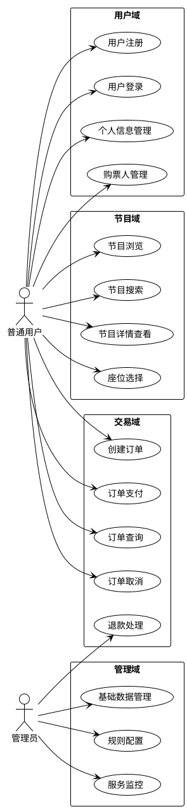
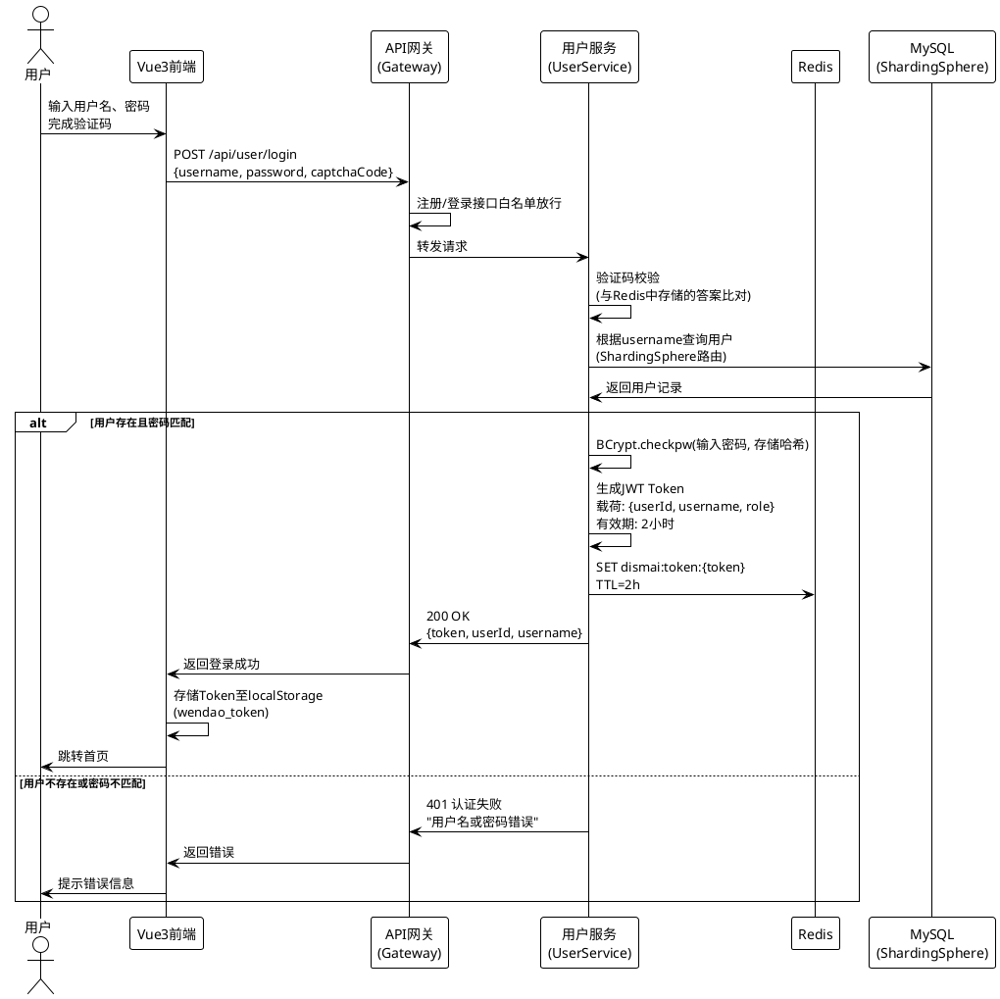
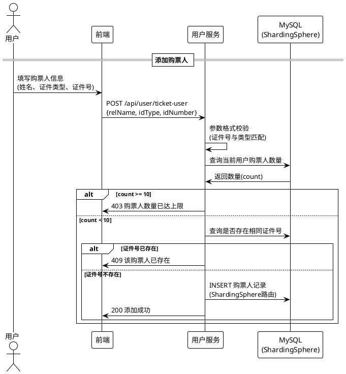
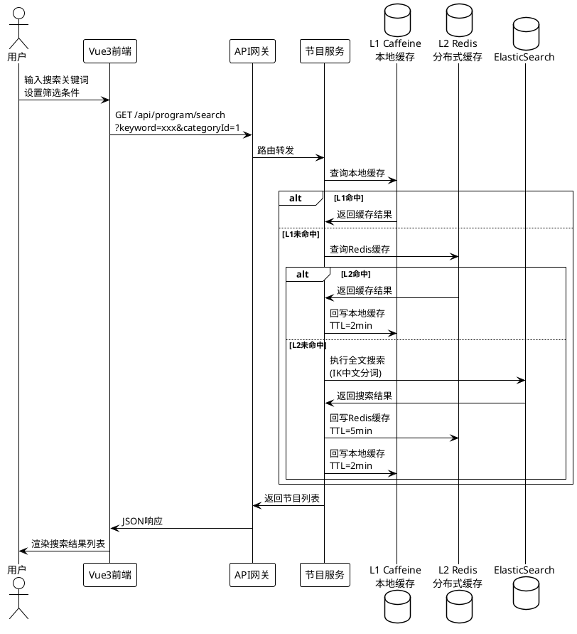
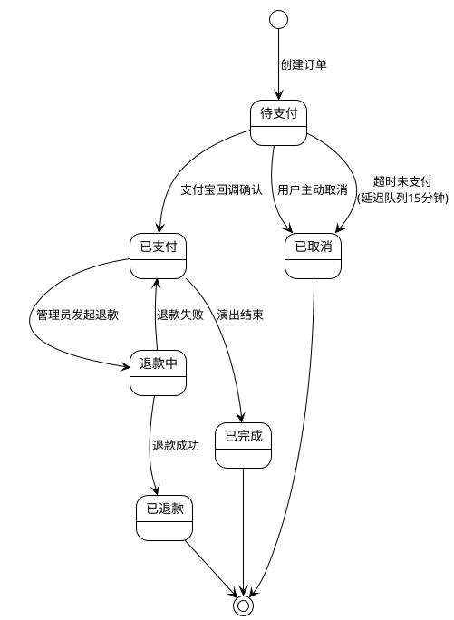
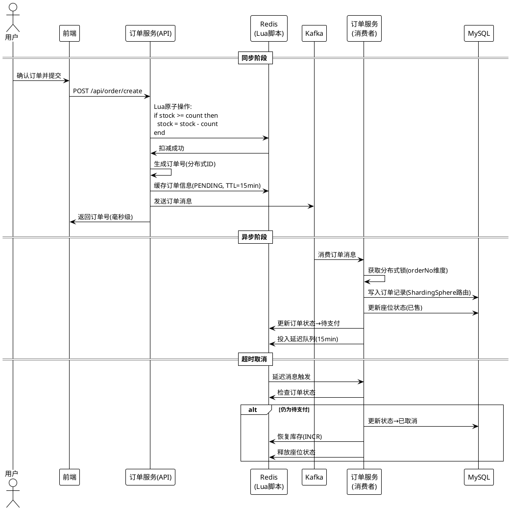
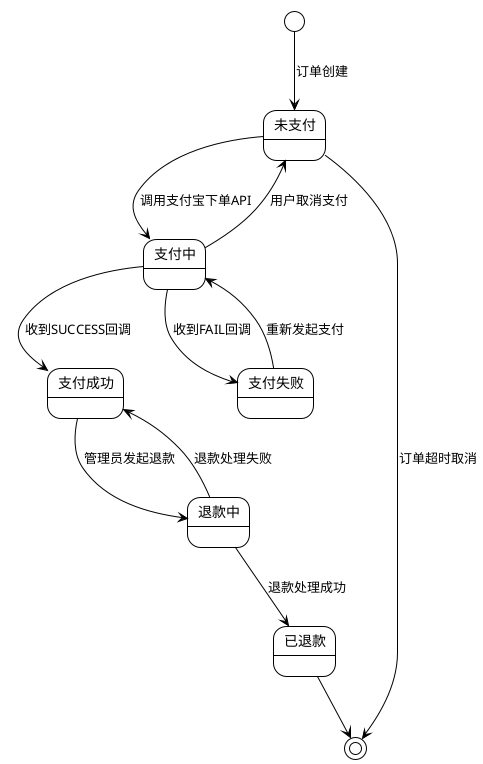
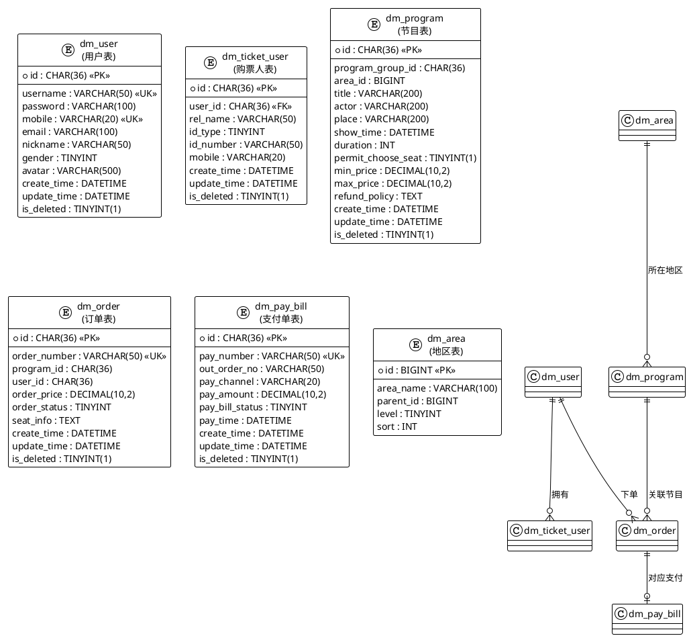
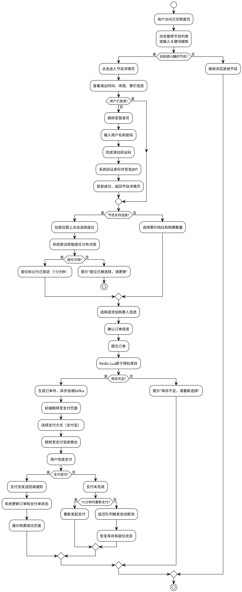

# 万花筒高并发在线票务服务系统
# 软件需求说明书
---

| 项目 | 内容 |
| --- | --- |
| 案卷号 | DISMAI-SRS-2026-001 |
| 日期 | 2026年5月 |
| 项目名称 | 万花筒高并发在线票务服务系统 |
| 项目标识 | Dismai Ticketing System |
| 编制 | 万花筒开发团队 |
| 审核 | — |
| 批准 | — |

---

**修改历史记录**

| 版本 | 日期 | 修改说明 | 修改人 |
| --- | --- | --- | --- |
| V1.0 | 2026-05 | 初始版本，完成全部需求分析 | 万花筒开发团队 |

---

## 目录
+ [1 引言](#1-引言)
    - [1.1 编写目的](#11-编写目的)
    - [1.2 范围](#12-范围)
    - [1.3 定义](#13-定义)
    - [1.4 参考资料](#14-参考资料)
+ [2 项目概述](#2-项目概述)
    - [2.1 产品描述](#21-产品描述)
    - [2.2 产品功能](#22-产品功能)
    - [2.3 用户特点](#23-用户特点)
    - [2.4 一般约束](#24-一般约束)
    - [2.5 假设和依据](#25-假设和依据)
+ [3 具体需求](#3-具体需求)
    - [3.1 功能需求](#31-功能需求)
    - [3.2 外部接口需求](#32-外部接口需求)
    - [3.3 性能需求](#33-性能需求)
    - [3.4 设计约束](#34-设计约束)
    - [3.5 属性](#35-属性)
    - [3.6 其他需求](#36-其他需求)
+ [4 附录](#4-附录)

---

## 1 引言
### 1.1 编写目的
本文档是"万花筒高并发在线票务服务系统"（以下简称"万花筒系统"）的软件需求说明书。编写本文档的目的在于，对万花筒系统所需实现的全部功能、外部接口、性能指标以及各项非功能性约束进行完整、准确、无歧义的描述，从而为后续的概要设计、详细设计、编码实现与系统测试提供一致性的需求基准。

本文档面向的读者包括：项目经理——用于确认需求范围和项目边界；系统架构师与后端开发工程师——用于理解各模块的输入、处理逻辑和输出要求；前端开发工程师——用于明确用户界面交互需求和数据格式要求；测试工程师——用于制定测试计划和设计测试用例的需求依据；运维工程师——用于了解性能指标和部署约束。任何对本系统需求产生的变更，均应以本文档为基准进行评审、记录和跟踪。

### 1.2 范围
本软件的正式名称为"万花筒高并发在线票务服务系统"，英文标识为 Dismai Ticketing System。本系统是一个面向公众消费者的在线票务交易平台，为用户提供演唱会、话剧歌剧、体育比赛、儿童亲子等多种类型娱乐节目的在线浏览、选座、订票、支付及订单管理服务。

本系统将要完成的工作包括：用户身份的注册与认证管理、节目信息的发布与全文搜索、座位的实时选择与锁定、高并发场景下的订单安全创建、支付宝支付的集成与回调处理、订单生命周期的全流程管理（包含超时自动取消机制），以及基础数据的维护和系统运行状态的监控。

本系统不包含以下功能：二手票转让与票务分销、微信支付与银行卡直连、3D场馆虚拟现实模拟、票务内容创作与直播、社交通讯功能，以及财务报表与商业智能分析。

本需求说明书与上级文档（项目任务书）中关于系统业务范围和核心功能的描述保持一致。如有差异，以本文档所述为准。

### 1.3 定义
本文档中使用的专业术语和缩略语定义如下表所示。

| 术语/缩写 | 含义说明 |
| --- | --- |
| JWT | JSON Web Token，一种基于JSON的开放标准令牌格式（RFC 7519），用于在各微服务之间安全地传输用户身份信息和访问权限声明 |
| 微服务 | 一种将单体应用程序按照业务域拆分为多个小型、自治、独立部署的服务单元的架构风格 |
| Spring Cloud | 基于Spring Boot的微服务开发框架集合，提供服务发现、配置管理、负载均衡、熔断限流等分布式系统能力 |
| Nacos | 阿里巴巴开源的动态服务发现、配置管理和服务管理平台，本系统将其用作服务注册中心和配置中心 |
| Redis | 高性能的内存数据结构存储系统，本系统将其用作分布式缓存、分布式锁的底层存储以及延迟队列的实现基础 |
| Kafka | Apache基金会的分布式流处理平台，本系统将其用作高吞吐量的异步消息队列 |
| ElasticSearch | 基于Apache Lucene构建的分布式搜索和分析引擎，本系统将其用于节目信息的全文检索 |
| ShardingSphere | Apache基金会的分布式数据库中间件，本系统利用其分库分表能力对核心业务数据进行水平拆分 |
| Redisson | Redis的Java高级客户端框架，封装了分布式锁、布隆过滤器、延迟队列等高级分布式数据结构 |
| 布隆过滤器 | 一种空间效率极高的概率型数据结构，用于快速判断一个元素是否可能存在于集合中，存在一定误判率但不会漏判 |
| Feign | Spring Cloud生态中的声明式HTTP客户端，用于简化微服务之间的远程过程调用 |
| 分库分表 | 将逻辑上统一的数据库水平拆分为多个物理数据库和数据表的技术方案，目的是分散单一数据库的存储和查询压力 |
| 灰度发布 | 一种渐进式的软件发布策略，将新版本服务先推向一小部分用户群体进行验证，确认无误后再逐步扩大覆盖面 |
| QPS | Queries Per Second，每秒查询率，衡量系统在单位时间内处理查询请求能力的指标 |
| TPS | Transactions Per Second，每秒事务数，衡量系统在单位时间内处理完整事务能力的指标 |
| 缓存穿透 | 查询一个在缓存和数据库中均不存在的数据，导致每次请求都直接击穿缓存层到达数据库层的现象 |
| 缓存击穿 | 某个高频访问的缓存键在过期的瞬间，大量并发请求同时穿透缓存层直接访问数据库的现象 |
| 缓存雪崩 | 大量缓存键在同一时刻集中过期，导致大量请求瞬间全部涌向数据库的现象 |
| 超卖 | 在高并发场景下，商品（座位/票）的实际售出数量超过了可售库存数量的异常情况 |
| 幂等性 | 同一个操作执行一次与执行多次所产生的效果完全相同的特性，在分布式环境中用于保证请求重试的安全性 |

### 1.4 参考资料
本文档编写过程中参考了以下资料。

| 序号 | 文献标题 | 编号/版本 | 出版/发布机构 |
| --- | --- | --- | --- |
| 1 | 计算机软件需求说明编制指南 | GB/T 9385-2008 | 中华人民共和国国家标准 |
| 2 | 计算机软件文档编制规范 | GB/T 8567-2006 | 中华人民共和国国家标准 |
| 3 | Spring Boot Reference Documentation | 3.3.0 | Spring / VMware |
| 4 | Spring Cloud Documentation | 2023.0.2 | Spring / VMware |
| 5 | Spring Cloud Alibaba Reference | 2023.0.1.0 | 阿里巴巴集团 |
| 6 | Apache ShardingSphere User Manual | 5.x | Apache基金会 |
| 7 | ElasticSearch Reference | 8.x | Elastic公司 |
| 8 | Apache Kafka Documentation | 3.x | Apache基金会 |
| 9 | Vue 3 Official Documentation | 3.x | Vue.js Team |
| 10 | Redisson Reference Guide | Latest | Redisson |

---

## 2 项目概述
### 2.1 产品描述
万花筒高并发在线票务服务系统是一个面向大众消费者的综合性在线票务交易平台。该系统的设计初衷是为用户提供一站式的演出票务购买服务——从节目浏览、信息搜索、座位选择，到在线下单、电子支付和订单管理，全流程均可在Web端完成。系统涵盖的节目类型广泛，包括但不限于演唱会、话剧歌剧、体育赛事和儿童亲子活动。

本系统的开发背景源于当前在线票务市场的核心技术挑战：热门节目开票时的瞬时高并发流量。以热门演唱会为例，开票瞬间可能涌入数万甚至数十万用户同时抢票，系统必须在极短时间内完成大量订单的并发创建，同时确保每张票不会被重复售出（即防止超卖）。因此，万花筒系统在架构设计上将高并发处理能力作为核心关注点，采用了微服务架构、多级缓存、分布式锁、消息队列异步处理、数据库分库分表等一系列技术手段来满足这一需求。

本系统与外部系统的关系主要体现在支付环节：系统通过集成支付宝开放平台的支付接口来完成在线支付功能，支付宝作为唯一的第三方支付通道。此外，系统在基础设施层依赖若干中间件服务（MySQL数据库、Redis缓存、Kafka消息队列、ElasticSearch搜索引擎、Nacos服务注册中心），这些中间件服务作为系统运行的支撑环境，不属于本系统的开发范围，但其可用性和性能直接影响系统的运行质量。

以下系统上下文图展示了万花筒系统与外部实体之间的交互关系：

<!-- 这是一个文本绘图，源码为：@startuml
!theme plain
title 万花筒系统上下文图

actor "普通用户\n（终端消费者）" as User
actor "系统管理员" as Admin

package "万花筒票务系统" {
  rectangle "API网关\ndismai-gateway" as Gateway
  rectangle "用户服务" as US
  rectangle "节目服务" as PS
  rectangle "订单服务" as OS
  rectangle "支付服务" as PAS
  rectangle "基础数据服务" as BS
  rectangle "自定义规则服务" as CS
  rectangle "管理后台服务" as AS
}

cloud "支付宝开放平台" as Alipay
database "MySQL数据库集群\n(ShardingSphere)" as MySQL
database "Redis缓存集群" as Redis
database "ElasticSearch集群" as ES
queue "Apache Kafka" as Kafka
cloud "Nacos注册/配置中心" as Nacos

User --> Gateway : HTTPS请求
Admin --> AS : HTTPS管理操作
Gateway --> US
Gateway --> PS
Gateway --> OS
Gateway --> PAS
Gateway --> BS
Gateway --> CS

PAS --> Alipay : 支付/退款API
OS --> Kafka : 异步消息
PS --> ES : 全文索引与搜索
US --> MySQL : 用户数据读写
OS --> MySQL : 订单数据读写
PAS --> MySQL : 支付数据读写
PS --> MySQL : 节目数据读写
US --> Redis : 缓存/布隆过滤器
OS --> Redis : 缓存/锁/延迟队列
PS --> Redis : 多级缓存
Gateway --> Nacos : 服务发现与路由
@enduml -->

### 2.2 产品功能
万花筒系统的产品功能可按业务领域划分为四个核心功能域：用户域、节目域、交易域和管理域。

在用户域方面，系统提供完整的用户生命周期管理能力。用户可以通过填写用户名、密码和手机号完成注册，注册过程中系统通过布隆过滤器在毫秒级完成用户名和手机号的唯一性校验。注册完成后用户可使用用户名和密码登录系统，系统通过BCrypt算法验证密码并签发JWT令牌作为后续请求的身份凭证。此外，用户可以管理自己的个人信息（包括昵称、头像、性别等），还可以添加、修改和删除常用购票人信息，购票人信息绑定了真实姓名和证件号码，用于购票时的身份核验。

在节目域方面，系统为用户提供丰富的节目浏览与搜索能力。首页根据节目类型（演唱会、话剧歌剧、体育赛事、儿童亲子）分类展示推荐节目列表。用户可以通过关键词搜索功能查找感兴趣的节目，搜索引擎基于ElasticSearch实现，支持节目名称、演出者、演出场馆等多维度的模糊匹配和精确筛选。用户点击进入节目详情页后，可以查看演出时间、场馆地址、票价档次、退款政策等完整信息，并在座位图上选择具体座位。选座操作通过分布式锁实现排他性控制，确保同一座位不会被多个用户同时选中。

以下用例图展示了系统的主要功能与用户角色的关系：

在交易域方面，系统实现了从下单到支付的完整交易闭环。用户选座后提交订单，系统在高并发环境下通过Redis Lua脚本原子性地检查并预扣库存，随后将订单创建任务发送到Kafka消息队列进行异步处理，从而将核心下单路径的响应时间压缩至毫秒级。订单创建后用户需在15分钟内完成支付，系统集成了支付宝支付接口，支持网页支付跳转。支付完成后支付宝通过回调通知系统更新订单和支付单状态。若用户未在规定时间内完成支付，系统通过Redis延迟队列自动触发订单取消流程，释放被占用的座位和库存。用户还可以在待支付状态下主动取消订单，或查询历史订单列表和订单详情。

在管理域方面，系统为管理员提供了基础数据维护、业务规则配置和服务运行监控能力。管理员可以维护地区信息（省市区三级）等基础字典数据，配置API级别的限流规则和业务深度规则（如购票数量限制、退款时间窗口等），以及通过Spring Boot Admin面板监控各微服务的健康状态和运行指标。

### 2.3 用户特点
本系统的用户主要分为两类：普通用户和系统管理员。

普通用户是系统的终端消费者，年龄跨度广泛（16岁至60岁），教育背景多样，但均具备基本的互联网使用能力和在线支付经验。普通用户的使用频率呈现明显的事件驱动特征——通常在有感兴趣的节目上线或开票时集中使用系统，平时使用频率较低。在技术水平方面，普通用户能够熟练操作Web浏览器、填写表单、完成在线支付等常规操作，但不具备也不需要任何技术开发背景。普通用户对系统的核心期望集中在两个方面：一是在热门节目开票时系统能够快速响应，保证抢票体验的流畅性；二是购票和支付流程的安全性和可靠性。

系统管理员是负责系统日常运维和管理的技术人员，人数较少（通常2至5人），均具备IT技术背景，熟悉Web应用管理、数据库操作以及微服务架构的基本概念。管理员日常使用系统进行基础数据维护、业务规则配置和系统状态监控，对系统的核心期望是提供直观高效的管理界面和实时准确的监控数据。

### 2.4 一般约束
在管理和运营方面，本系统作为课程实践项目，暂不涉及商业运营层面的合规性要求，但在技术实现上遵循生产级别的安全和性能标准。

在硬件方面，系统对终端用户设备无特殊要求，用户通过标准浏览器访问即可；服务端部署需要至少2台以上应用服务器以保障基本的高可用性，数据库服务器需配备SSD存储以满足高并发场景下的I/O性能需求。

在接口约束方面，系统的所有对外API均遵循RESTful设计规范，统一使用JSON格式进行数据交换，并通过统一的响应封装格式（包含code、msg和data三个字段）返回结果。与外部系统（支付宝）的接口对接需遵循支付宝开放平台的接口协议和安全签名规范。

在并行操作方面，系统需要支持大量用户同时在线浏览和搜索节目信息，并在开票高峰期承受数万用户同时进行选座和下单操作。这一约束决定了系统必须在架构层面采用微服务拆分、多级缓存、异步消息处理和数据库水平分片等技术手段来保障并发处理能力。

在安全约束方面，所有API请求通过API网关统一鉴权，使用JWT令牌机制进行身份验证；用户密码使用BCrypt算法加密存储，不可逆；敏感操作（如注册、登录）前需通过滑动验证码进行人机校验。

在开发语言和技术栈方面，后端采用Java 17编程语言，基于Spring Boot 3.3和Spring Cloud 2023框架体系进行开发；前端采用Vue 3框架配合Vite构建工具进行开发。数据库使用MySQL 8.0，通过ShardingSphere中间件实现分库分表；缓存层使用Redis 7.x；消息队列使用Apache Kafka；搜索引擎使用ElasticSearch 8.x；服务注册与配置中心使用Nacos 2.3以上版本。

### 2.5 假设和依据
本文档中的需求描述基于以下假设和依据。

在运行环境方面，假设部署环境的网络连接稳定可靠，各中间件服务（MySQL、Redis、Kafka、ElasticSearch、Nacos）均已正确安装并处于正常运行状态，且版本满足上述技术栈约束中的要求。假设支付宝沙箱环境或正式环境的API密钥已配置就绪，支付宝的接口服务在正常情况下可用。

在用户端方面，假设用户使用的浏览器为现代版本（Chrome 90及以上、Firefox 88及以上、Edge 90及以上、Safari 14及以上），支持ECMAScript 2020标准和CSS Grid布局。假设用户设备的屏幕分辨率不低于1024×768像素。假设用户具备基本的在线支付操作经验。

在业务规则方面，假设每场节目的座位数量是预先确定且有限的。假设每位用户在同一场节目中的最大购票数量受到系统限制（默认每人最多5张）。假设订单创建后的支付限定时间为15分钟，超时未支付的订单将被系统自动取消。

在技术架构方面，假设各微服务部署在同一机房内，服务间网络延迟不超过5毫秒。假设数据库、缓存等中间件可根据实际负载需要进行水平扩展。如果上述假设条件发生变化，可能需要对部分需求和设计方案进行相应调整。

---

## 3 具体需求
### 3.1 功能需求
#### 3.1.1 用户注册与登录
**功能介绍**

用户注册与登录功能是用户使用本系统全部业务功能的前置条件。注册功能允许新用户通过填写用户名、密码、手机号等基本信息创建系统账号。在注册过程中，系统通过布隆过滤器在毫秒级别完成用户名和手机号的全局唯一性校验，避免了传统数据库查询带来的性能瓶颈。用户密码经BCrypt算法加密后存储，确保即使数据泄露也无法被逆向还原。登录功能接受用户名和密码作为凭据，验证通过后签发JWT令牌，后续所有需要身份认证的接口调用均通过该令牌进行鉴权。注册和登录操作均需通过滑动验证码进行人机校验，以防止自动化工具的恶意注册和暴力破解。

**输入项**

注册请求需要提供以下数据：用户名（username），为4至20个字符的字符串，仅允许包含字母、数字和下划线，在整个系统中全局唯一；密码（password），为8至32个字符的字符串，需同时包含字母和数字；确认密码（confirmPassword），必须与密码字段完全一致；手机号码（mobile），为符合中国大陆11位手机号格式的字符串；电子邮件（email），为可选字段，需符合标准邮箱地址格式；验证码校验值（captchaCode），为滑动验证码或点击验证码的验证结果。

登录请求需要提供：用户名（username）；密码（password）；验证码校验值（captchaCode）。

以上数据均由用户在前端页面的表单中输入，通过HTTP POST请求以JSON格式提交至API网关。

**处理过程**

注册处理流程如下：前端收集用户填写的注册信息并完成客户端格式校验，将数据以JSON格式POST到API网关的用户注册接口。网关识别到注册接口属于免认证白名单，直接将请求转发至用户服务。用户服务首先对所有输入参数进行服务端校验（包括格式、长度、一致性等），若校验不通过则立即返回具体的参数错误信息。参数校验通过后，系统使用布隆过滤器检查用户名和手机号是否已被注册——布隆过滤器在O(1)时间内完成判断，若判定已存在则直接返回"用户已存在"的错误响应。若布隆过滤器判定不存在，系统对用户密码执行BCrypt加密，生成UUID作为用户主键ID，然后通过ShardingSphere将用户记录写入对应的分库（根据用户ID的哈希值路由至dismai_user_0或dismai_user_1库）。写入成功后，系统将新用户的用户名和手机号加入布隆过滤器，最终返回注册成功的响应。

以下时序图描述了用户登录的处理过程：

**输出项**

注册成功时，系统返回JSON响应，包含状态码200、成功消息，以及数据体中的用户ID（UUID格式字符串）和用户名。登录成功时，系统返回JSON响应，包含状态码200、成功消息，以及数据体中的JWT令牌字符串、用户ID、用户名和用户角色。

**错误处理**

当请求参数格式不合法时（如用户名长度不足、密码不含字母等），系统返回400状态码及具体的字段校验错误描述。当用户名或手机号已被注册时，系统返回409状态码及"用户已存在"的提示。当登录时用户名或密码错误时，系统统一返回401状态码及"用户名或密码错误"的提示——为防止用户名枚举攻击，系统不区分"用户不存在"和"密码错误"两种情况。当同一IP地址的登录尝试过于频繁时（超过每分钟10次），系统返回429状态码并要求用户稍后再试。当系统内部出现预期外的异常时，系统记录错误日志并返回500状态码及"系统繁忙，请稍后再试"的通用提示。

#### 3.1.2 用户信息管理
**功能介绍**

用户信息管理功能允许已登录用户查看和修改自己的个人基本信息。系统通过解析请求头中的JWT令牌识别当前登录用户的身份，确保每个用户只能查看和修改属于自己的信息，不能访问其他用户的数据。

**输入项**

查看个人信息时，系统仅需HTTP请求头中携带的JWT令牌，无需额外输入。修改个人信息时，用户可以提交以下可选字段：昵称（nickname），2至20个字符的字符串；头像地址（avatar），符合URL格式的字符串；手机号码（mobile），11位手机号格式；电子邮件（email），标准邮箱格式；性别（gender），取值为0（未知）、1（男）或2（女）的整数。所有字段均为可选，用户可以只修改其中一个或多个字段。

**处理过程**

查看个人信息时，前端发送GET请求至API网关，网关从请求头中解析JWT令牌、提取用户ID并转发至用户服务。用户服务首先尝试从Redis缓存中查询用户信息，若缓存命中则直接返回；若缓存未命中则通过ShardingSphere路由到对应分库查询用户记录，将结果回写Redis缓存（设置30分钟有效期）后返回。修改个人信息时，前端发送PUT请求，用户服务对输入参数进行校验后先更新数据库中的用户记录，更新成功后删除Redis中该用户的缓存数据（采用Cache-Aside模式），确保下次查询时能够获取到最新数据。

**输出项**

系统返回JSON响应，数据体中包含用户的完整个人信息：用户ID、用户名、昵称、手机号（中间四位脱敏为星号）、邮箱、性别、头像地址和账号创建时间。

**错误处理**

当JWT令牌过期或无效时，系统返回401状态码并引导用户重新登录。当修改参数不合法时，系统返回400状态码及具体的校验错误信息。当根据令牌中的用户ID在数据库中查询不到对应记录时（极端异常情况），系统返回404状态码。

#### 3.1.3 购票人管理
**功能介绍**

购票人管理功能允许用户维护一组常用购票人信息。在购票环节，用户可以快速选择已保存的购票人，无需每次重新手工输入姓名和证件信息。每个购票人需要绑定真实姓名和有效证件信息（支持身份证、护照和其他证件类型），这些信息将用于入场时的身份核验。每个用户最多可保存10个常用购票人。

**输入项**

添加购票人时需要提供：购票人真实姓名（relName），2至50个字符的字符串；证件类型（idType），取值为1（身份证）、2（护照）或3（其他）的整数；证件号码（idNumber），格式需与所选证件类型匹配（身份证为18位、护照为字母数字组合等）；联系电话（mobile），为可选字段，11位手机号格式。修改购票人时的输入项与添加相同，额外需要在URL路径中指定购票人ID。删除购票人时只需在URL路径中指定购票人ID。

**处理过程**

添加购票人时，系统首先校验输入参数格式的合法性，特别是证件号码与证件类型的匹配性。随后查询当前用户已有的购票人数量，若已达到上限（10人），则拒绝添加并提示用户先删除不需要的购票人。若未达上限，系统还会检查同一用户名下是否已存在相同证件号码的购票人记录以避免重复添加。校验全部通过后，系统生成UUID作为购票人ID，通过ShardingSphere路由将记录写入对应分库的购票人表。删除操作采用软删除机制，将记录的is_deleted字段标记为1而非物理删除，以便必要时进行数据追溯。

**输出项**

查询购票人列表时，系统返回JSON响应，数据体中包含购票人数组和总数。每个购票人对象包含：购票人ID、真实姓名、证件类型、证件号码（脱敏显示，仅展示首尾各4位）和联系电话。

**错误处理**

当证件号码格式与所选证件类型不匹配时，系统返回400状态码并提示正确的格式要求。当同一证件号码已被该用户添加过时，系统返回409状态码提示购票人已存在。当购票人数量达到10人上限时，系统返回403状态码提示用户先删除后再添加。

#### 3.1.4 节目浏览与搜索
**功能介绍**

节目浏览与搜索功能为用户提供发现和查找节目信息的能力。首页按照节目类型分类展示推荐节目和热门节目卡片列表，用户可以按照一级分类（演唱会、话剧歌剧、体育赛事、儿童亲子）和二级分类进行筛选，也可以按照地区进行过滤。全文搜索功能基于ElasticSearch实现，支持用户通过关键词（如演出者姓名、节目名称、演出场馆等）进行模糊匹配搜索，并可叠加分类、地区、日期范围和价格区间等多种筛选条件。搜索结果按照相关度或用户指定的排序规则（时间、价格、热度）进行排列，并以分页方式返回。

为了保障搜索接口在高并发场景下的响应速度，系统采用了L1（Caffeine本地缓存）+ L2（Redis分布式缓存）的多级缓存架构。查询请求首先访问本地缓存，若未命中则查询Redis缓存，Redis缓存也未命中时才最终查询ElasticSearch，搜索结果逐级回填至缓存。

以下数据流图展示了节目搜索的数据流转过程：

**输入项**

首页浏览场景的输入包括：一级节目分类ID（parentProgramCategoryId），可选的长整型数值；二级节目分类ID（programCategoryId），可选的长整型数值；地区ID（areaId），可选的长整型数值；页码（pageNo），默认为1；每页条数（pageSize），默认为20。

关键词搜索场景的输入包括：搜索关键词（keyword），至少2个字符的字符串；以及上述所有可选筛选参数，外加演出开始日期（startDate）、演出结束日期（endDate）、最低价格（priceMin）、最高价格（priceMax）、排序字段（sortField，可选值为time、price、hot）和排序方向（sortOrder，可选值为asc、desc）。

**处理过程**

系统接收到搜索请求后，按照"L1本地缓存→L2 Redis缓存→ElasticSearch"的顺序逐级查询。ElasticSearch中为节目数据建立了中文分词索引（使用IK分词器），支持对节目标题、演出者、场馆名称等字段的全文匹配。搜索结果经分页包装后返回给前端。

**输出项**

系统返回JSON响应，数据体中包含节目列表数组和分页信息。每个节目对象包含：节目ID、标题、演出者、演出场馆、所在地区名称、节目分类名称、演出时间、最低票价、最高票价、海报图片URL，以及是否支持选座的布尔标记。

**错误处理**

当搜索关键词为空或长度不足2个字符时，系统返回400状态码提示输入更多字符。当ElasticSearch服务不可用时，系统自动降级为MySQL数据库的LIKE模糊查询，虽然搜索精度和速度有所下降，但保证功能可用。当搜索请求频率超过限流阈值时，系统返回429状态码提示用户稍后重试。

#### 3.1.5 节目详情与座位选择
**功能介绍**

用户从节目列表点击进入某场节目的详情页后，系统展示该节目的全部信息，包括演出时间、地点、演出者、各档票价及其剩余座位数量、购票须知和退款政策等。对于支持选座的节目，系统还展示该场次的座位图，用户可以在座位图上点击选择具体的座位。当用户选中某个座位时，系统通过Redisson获取该座位的分布式锁，在锁保护下检查座位状态并将其标记为"已锁定"，锁定有效期为15分钟（与支付超时时间一致），确保在同一时刻只有一个用户能够成功锁定同一个座位。

**输入项**

获取节目详情时需要在URL路径中提供节目ID（programId），为UUID格式的字符串。选择座位时需要以JSON格式提交：节目ID（programId）；所选座位ID列表（seatIds），为字符串数组；对应的购票人ID列表（ticketUserIds），为字符串数组，需与座位ID列表一一对应。

**处理过程**

获取节目详情时，系统通过多级缓存（Caffeine→Redis→MySQL）获取节目基本信息和票价档次列表，同时从Redis中获取各档次的实时剩余库存数量和座位状态图。座位图以Redis Hash结构存储，每个field为座位ID，value为座位状态（available、locked、sold）。

选座时的处理流程如下：系统对每个待选座位依次尝试获取分布式锁（锁Key格式为seat:{programId}:{seatId}，锁超时30秒），若获取锁成功则检查该座位在Redis中的状态，若状态为available则将其更新为locked并设置15分钟过期时间，释放分布式锁后继续处理下一个座位；若座位状态已不是available（被他人抢先锁定或已售出），则释放锁并返回该座位已不可选的错误信息。

**输出项**

节目详情响应的数据体包含：节目ID、标题、演出者、场馆名称、场馆地址、演出时间、演出时长（分钟）、是否支持选座、各票价档次列表（每项包含价格ID、档次名称、单价和剩余数量）、座位图数据（包含总行数、总列数以及座位数组，每个座位包含ID、行号、列号、关联票价ID和当前状态）、购票须知文本和退款政策文本。

**错误处理**

当节目ID不存在或节目已下架时，系统返回404状态码提示节目不存在。当所选座位已被他人锁定或售出时，系统返回409状态码提示用户更换座位。当用户选择的座位数量超过单人限购上限时，系统返回403状态码提示限购规则。

#### 3.1.6 订单创建与管理
**功能介绍**

订单模块是本系统在高并发场景下的核心优化对象。用户完成座位选择后提交订单，系统在保证数据一致性（不超卖）的前提下，尽可能快速地完成订单创建。为此，系统设计了四种渐进式的订单创建方案：V1基础版直接操作数据库，适用于低并发场景；V2缓存版引入Redis预加载库存，减少数据库读压力；V3分布式锁版使用Redisson分布式锁防止超卖；V4异步版通过Redis Lua脚本原子预扣库存后将订单写入操作异步投递至Kafka消息队列，将核心下单路径的响应时间压缩至毫秒级。V4版本为系统默认且推荐使用的版本。

订单从创建到结束经历以下状态转换过程：

**输入项**

创建订单时需要提交：节目ID（programId），字符串；已锁定的座位ID列表（seatIds），字符串数组；与座位一一对应的购票人ID列表（ticketUserIds），字符串数组；票价档位ID（priceId），字符串。

**处理过程**

V4异步版本的处理过程分为同步预检查阶段和异步写入阶段。在同步阶段，系统执行Redis Lua脚本原子性地完成库存检查与预扣减操作——Lua脚本在Redis服务端以单线程方式执行，保证了检查和扣减的原子性，从根本上杜绝了超卖问题。预扣减成功后，系统通过分布式ID生成器生成全局唯一的订单号，将订单基本信息以PENDING状态缓存到Redis（TTL为15分钟），然后将包含完整订单数据的消息发送到Kafka的dismai-order-create主题。此时同步阶段完成，系统立即向前端返回订单号和"订单创建中"的状态。

在异步阶段，订单服务的Kafka消费者从dismai-order-create主题中拉取订单消息，获取以订单号为维度的分布式锁后，将订单记录通过ShardingSphere路由写入对应的分库分表，同时更新座位状态。写入成功后更新Redis中订单状态为"待支付"，并向Redis延迟队列中投入一条延迟消息，设定15分钟后触发。当延迟消息到达触发时间后，系统检查该订单的支付状态，若仍为"待支付"则自动将订单状态更新为"已取消"，并恢复Redis中的座位库存和座位状态。

**输出项**

订单创建成功时，系统返回JSON响应，数据体包含订单号、订单状态（PENDING或UNPAID）、订单总金额、节目标题、座位信息描述、支付截止时间和订单创建时间。

**错误处理**

当库存不足或座位已售出时，Redis Lua脚本返回扣减失败，系统直接返回409状态码提示用户重新选座。当用户的购票数量超过该节目的个人限购数量时，系统返回403状态码提示限购规则。当下单请求触发限流时，系统返回429状态码。当Kafka消费者处理订单写入失败时，系统会自动进行3次重试，3次都失败后将消息投入死信队列，并自动恢复Redis中预扣的库存。

#### 3.1.7 支付处理
**功能介绍**

订单创建成功后，用户需要在15分钟的限定时间内完成支付。系统当前集成了支付宝支付接口，支持网页跳转支付方式。用户点击"立即支付"后，系统向支付宝发起交易创建请求并获得支付页面URL，前端将用户重定向至支付宝收银台页面完成支付操作。支付完成后，支付宝通过异步回调通知本系统支付结果，系统验证回调签名后更新支付单和订单状态。

支付单的状态转换过程如下：

**输入项**

发起支付时需要提交：订单号（orderNumber），字符串；支付渠道（payChannel），当前仅支持"alipay"。支付回调由支付宝服务器发起，包含交易号、交易状态、交易金额等标准回调参数以及签名信息。

**处理过程**

发起支付时，支付服务首先查询订单信息并验证订单状态必须为"待支付"，然后生成系统内部的支付单号，调用支付宝的alipay.trade.page.pay接口创建交易并获取支付页面的表单HTML或跳转URL，将该URL返回给前端。前端引导用户跳转至支付宝完成支付。

当支付宝处理完支付后，通过HTTP POST方式向系统预设的回调URL发送异步通知。支付服务收到回调后，首先使用支付宝公钥对回调参数进行签名验证以确保请求的真实性，验证通过后根据回调中的交易状态更新支付单状态（SUCCESS或FAIL），若支付成功则同步更新关联订单的状态为"已支付"，并从Redis延迟队列中移除该订单的超时取消任务。为保证幂等性，系统在处理回调前会检查支付单当前状态，若已是SUCCESS则直接返回成功而不做重复处理。

**输出项**

发起支付时，系统返回JSON响应，数据体包含支付单号和支付宝支付页面的跳转URL。支付回调处理完成后，系统向支付宝返回字符串"success"表示通知已被成功接收和处理。

**错误处理**

当订单状态不是"待支付"时（如已取消或已支付），系统返回400状态码提示订单状态异常。当支付超时（15分钟未完成支付）时，系统通过延迟队列自动取消订单并释放座位。当支付宝接口调用失败时，系统返回500状态码提示用户稍后重试。当收到重复的支付回调时，系统进行幂等处理，直接返回成功响应。

#### 3.1.8 订单查询与取消
**功能介绍**

用户可以查看自己的历史订单列表并按状态进行筛选，也可以查看单个订单的详细信息。对于处于"待支付"状态的订单，用户可以主动执行取消操作。取消操作完成后，系统自动释放被该订单占用的座位和预扣的库存。

**输入项**

查询订单列表时可提供：订单状态筛选条件（orderStatus），可选字符串；页码（pageNo），默认为1；每页条数（pageSize），默认为10。查看订单详情时需在URL路径中提供订单号（orderNumber）。取消订单时需提交：订单号（orderNumber），字符串；取消原因（reason），可选字符串。

**处理过程**

查询订单列表时，系统根据JWT令牌中的用户ID通过ShardingSphere路由至对应分库查询订单记录，支持按订单状态筛选和分页返回。取消订单时，系统首先验证订单状态必须为"待支付"，然后获取以订单号为维度的分布式锁防止并发取消，将订单状态更新为"已取消"，恢复Redis中的座位库存计数，将被锁定的座位状态重置为可用，并清除Redis延迟队列中该订单的超时取消任务。

**输出项**

订单列表响应包含订单数组和分页信息。每个订单对象包含：订单号、节目标题、订单状态、订单总金额、座位信息、演出时间、下单时间和支付时间（如有）。

**错误处理**

当订单号不存在时返回404状态码。当尝试取消非"待支付"状态的订单时返回400状态码提示应通过退款流程处理。当订单已被取消时进行幂等处理直接返回成功。

#### 3.1.9 基础数据管理
**功能介绍**

基础数据服务负责管理系统中的基础字典数据，主要包括地区信息（按省、市、区三级行政区划组织的树形结构数据）。这些基础数据被其他微服务通过Feign客户端接口调用获取，例如节目服务在展示节目信息时需要获取地区名称。

**输入项**

获取下级地区列表时需提供父级地区ID（parentId），长整型数值，根级别地区的parentId为0。获取单个地区信息时需提供地区ID。搜索地区时需提供搜索关键词（keyword）。

**处理过程**

地区数据以树形结构存储在dismai_base_data数据库的dm_area表中，该库为单库（不分片），因为数据量较小且变更频率极低。查询结果通过Redis缓存，缓存过期时间设置为24小时。系统启动时会预热地区数据到缓存中，确保运行时的查询性能。其他微服务通过dismai-base-data-client提供的Feign接口获取地区信息。

**输出项**

系统返回JSON响应，数据体为地区对象数组。每个地区对象包含：地区ID、地区名称、父级地区ID和行政层级。

#### 3.1.10 自定义规则配置
**功能介绍**

自定义规则服务允许管理员在不修改代码的前提下，通过配置化的方式灵活调整系统行为。规则分为两类：API规则（d_api_data表）用于配置特定API接口的请求频率限制和IP黑白名单；深度规则（d_depth_rule表）用于配置业务层面的约束参数，如每人限购数量、库存预警阈值和退款时间窗口等。

**处理过程**

管理员通过管理界面配置规则后，规则数据写入dismai_customize数据库。各微服务通过dismai-customize-client的Feign接口获取规则配置并缓存到本地。当规则发生变更时，系统通过Redis的发布/订阅机制向所有订阅了规则变更频道的服务实例发送通知，各实例收到通知后主动刷新本地缓存的规则数据。

#### 3.1.11 系统管理与监控
**功能介绍**

系统管理模块基于Spring Boot Admin实现，为管理员提供各微服务的运行状态监控能力。管理后台服务（dismai-admin-service）作为监控面板，从Nacos注册中心发现所有已注册的微服务实例，通过Spring Boot Actuator端点采集各服务的健康状态、JVM内存使用情况、垃圾回收统计、HTTP请求指标、数据库连接池使用率和Redis连接状态等运行指标。管理员可以通过Web界面实时查看各服务的健康状态，还可以动态调整服务的日志级别以辅助线上问题排查。

#### 3.1.12 验证码服务
**功能介绍**

验证码服务提供滑动验证码和点击验证码两种人机校验方式，在用户注册、登录等关键操作前触发，用于防止自动化脚本的恶意攻击。

**处理过程**

用户触发验证码时，前端向验证码服务请求获取验证码，服务端生成验证码图片（底图和滑块/点击目标）并将正确答案以token为Key存入Redis（TTL为5分钟），然后将验证码图片和token返回前端。用户完成验证操作后（如滑动到指定位置），前端将token和用户的操作结果提交至验证码服务进行校验。服务端从Redis中取出该token对应的正确答案，在允许的误差范围内（±5像素）进行比对，验证通过则将该token标记为已验证状态。

#### 3.1.13 网关路由与限流
**功能介绍**

API网关（dismai-gateway-service）是所有外部HTTP请求的统一入口，基于Spring Cloud Gateway实现。网关承担以下职责：根据请求URL路径前缀将请求路由至对应的后端微服务实例；解析请求头中的Authorization字段，验证JWT令牌的有效性和完整性（注册、登录等白名单接口跳过验证）；执行请求限流策略，防止瞬时流量击垮后端服务；实现灰度路由逻辑，根据请求头中的灰度标签将流量导向特定版本的服务实例；统一处理跨域（CORS）请求。

网关的路由规则配置如下：

| 请求路径前缀 | 目标微服务 |
| --- | --- |
| /api/user/** | dismai-user-service |
| /api/program/** | dismai-program-service |
| /api/order/** | dismai-order-service |
| /api/pay/** | dismai-pay-service |
| /api/base/** | dismai-base-data-service |
| /api/customize/** | dismai-customize-service |
| /api/captcha/** | 验证码服务（内嵌于captcha-framework） |

### 3.2 外部接口需求
#### 3.2.1 用户接口
本系统的前端界面基于Vue 3框架和Vite构建工具开发，采用单页应用（SPA）架构。整体界面布局分为三个区域：顶部导航栏（HeaderComponent）提供Logo展示、搜索框入口和用户登录状态信息；中间内容区（RouterView）根据当前路由动态渲染对应的页面组件；底部信息栏（FooterComponent）展示版权信息和辅助链接。

系统共包含9个主要页面。首页（路由 /）展示推荐节目轮播图和按分类组织的节目卡片列表，提供分类导航和搜索入口。登录页（路由 /login）包含用户名输入框、密码输入框、滑动验证码组件和登录按钮，验证通过后跳转首页并将JWT令牌存储至浏览器localStorage。注册页（路由 /register）包含用户名、密码、确认密码、手机号输入框和验证码组件。分类页（路由 /allType）通过顶部Tab栏切换节目分类，以列表形式展示该分类下的节目并支持分页加载。节目详情页（路由 /contentDetail/:id）展示节目完整信息和座位图组件，用户可在座位图上直接点击选择座位。订单确认页（路由 /order）汇总显示订单信息、已选座位和购票人，提供支付方式选择和确认提交按钮。订单管理页（路由 /orderManagement）以Tab方式（全部、待支付、已支付、已取消）分类展示历史订单卡片列表。个人中心页（路由 /personInfo）以只读方式展示用户的基本个人信息。账户设置页（路由 /accountSettings）提供信息修改表单、密码修改功能和购票人管理列表。

界面设计遵循以下规范：主色调为渐变蓝紫色系；正文字号为14像素，标题字号为16至24像素；所有交互按钮具有点击反馈动效；异步操作期间显示加载动画；错误提示以Toast形式弹出。系统支持1024像素及以上屏幕宽度的显示设备。

#### 3.2.2 硬件接口
本系统为纯Web应用，不直接与终端用户的任何特定硬件设备交互。服务端的硬件环境要求如下表所示。

| 硬件组件 | 最低配置 | 推荐配置 |
| --- | --- | --- |
| 应用服务器 | 4核CPU, 8GB内存, 100GB SSD | 8核CPU, 16GB内存, 200GB NVMe SSD |
| 数据库服务器 | 4核CPU, 16GB内存, 500GB SSD | 8核CPU, 32GB内存, 1TB NVMe SSD |
| Redis服务器 | 2核CPU, 4GB内存 | 4核CPU, 16GB内存 |
| ElasticSearch服务器 | 4核CPU, 8GB内存, 200GB SSD | 8核CPU, 32GB内存, 500GB SSD |
| 网络带宽 | 千兆以太网 | 万兆以太网 |

#### 3.2.3 软件接口
本系统与以下外部软件系统存在接口关系。

与支付宝开放平台的接口方面，系统调用支付宝的alipay.trade.page.pay接口发起网页支付交易，调用alipay.trade.query接口主动查询交易状态，调用alipay.trade.refund接口发起退款请求，调用alipay.trade.close接口关闭未支付的交易。所有接口均通过HTTPS协议以POST方式调用，请求参数和响应数据均采用JSON格式，每次请求均需使用RSA2算法进行签名以确保传输安全。系统使用的支付宝SDK版本为最新稳定版，接口规范详见支付宝开放平台开发者文档。

与Nacos注册配置中心的接口方面，各微服务在启动时通过HTTP协议向Nacos注册自身的服务实例信息（包括IP地址、端口号和元数据标签），运行期间定期发送心跳保持注册状态，并通过Nacos的配置管理功能拉取和监听动态配置变更。

与ElasticSearch的接口方面，节目服务通过RESTful API（HTTP协议）向ElasticSearch集群提交索引创建、文档写入和全文搜索请求，使用IK中文分词插件对节目标题和演出者等字段进行分词索引。

与Apache Kafka的接口方面，订单服务作为消息生产者通过Kafka的二进制协议（TCP）向指定Topic发送消息，同时作为消息消费者从Topic中拉取消息进行异步处理。

#### 3.2.4 通信接口
系统内部各微服务之间的通信方式分为同步调用和异步消息两种模式。

同步调用采用HTTP/1.1协议，通过Spring Cloud OpenFeign声明式客户端实现。系统共定义了7个Feign客户端模块，分别封装了对用户服务、节目服务、订单服务、支付服务、基础数据服务、自定义规则服务的远程调用接口。Feign客户端集成了负载均衡（通过Nacos服务发现）和重试机制，并在调用失败时触发熔断降级。

异步消息通过Apache Kafka实现，系统定义了以下消息主题：dismai-order-create主题由订单服务API层生产、订单服务消费者组消费，传递订单创建事件；dismai-pay-result主题由支付服务生产、订单服务消费，传递支付结果通知；dismai-order-cancel主题由订单服务生产、节目服务消费，传递订单取消事件以触发库存恢复。所有消息以JSON格式序列化，包含messageId、timestamp和业务载荷。

此外，系统使用Redis的发布/订阅机制（Pub/Sub）进行配置变更通知的广播，以及使用Redis Stream实现可靠消息传递。

### 3.3 性能需求
在静态指标方面，系统设计支持的注册用户总量为100万，其中日活跃用户数约为5万。系统需要同时维护的长连接数（主要为浏览和搜索场景下的HTTP连接）在日常时段为5,000个，在开票高峰期可达50,000个。数据库需要承载的核心业务数据量为：节目数据10万条、订单数据1,000万条（预计月增长100万条）、用户数据100万条。

在动态指标方面，各核心操作的响应时间要求如下表所示。

| 操作类型 | P50响应时间 | P95响应时间 | P99响应时间 |
| --- | --- | --- | --- |
| 首页加载（含静态资源） | ≤500毫秒 | ≤1秒 | ≤2秒 |
| 节目搜索（缓存命中） | ≤50毫秒 | ≤200毫秒 | ≤500毫秒 |
| 节目搜索（ES查询） | ≤200毫秒 | ≤500毫秒 | ≤1秒 |
| 节目详情（多级缓存命中） | ≤50毫秒 | ≤200毫秒 | ≤500毫秒 |
| 座位选择（含分布式锁） | ≤200毫秒 | ≤500毫秒 | ≤1秒 |
| 订单创建（V4异步版） | ≤100毫秒 | ≤300毫秒 | ≤500毫秒 |
| 支付发起（含支付宝API调用） | ≤500毫秒 | ≤1秒 | ≤2秒 |
| 用户登录（含BCrypt验证） | ≤300毫秒 | ≤500毫秒 | ≤1秒 |

在吞吐量方面，日常浏览场景下系统QPS不低于10,000；热门节目开票高峰期，核心下单接口的QPS需达到100,000以上，订单TPS需达到5,000以上；支付高峰期QPS需达到5,000以上。

### 3.4 设计约束
#### 3.4.1 其他标准的约束
本系统在报表格式方面，所有API接口的响应数据均采用统一的JSON封装格式，包含code（整型状态码）、msg（字符串描述信息）和data（业务数据对象）三个顶层字段。HTTP状态码的使用遵循RESTful规范：200表示成功、400表示客户端参数错误、401表示认证失败、403表示权限不足、404表示资源不存在、409表示资源冲突、429表示请求过于频繁、500表示服务端内部错误。

在数据命名方面，数据库表名使用小写字母加下划线分隔的命名方式，表前缀统一为"dm_"。实体字段在数据库中使用下划线命名（如create_time），在Java代码中使用驼峰命名（如createTime），MyBatis-Plus框架自动完成两者之间的映射转换。

在审计追踪方面，所有核心业务表均包含create_time（记录创建时间）和update_time（记录最后更新时间）字段，由MySQL自动维护。删除操作统一采用软删除方式，通过is_deleted字段标记，而非物理删除记录，以确保数据的可追溯性。所有通过API网关的请求均记录访问日志，包含请求时间、请求路径、源IP地址、响应状态码和响应时间。

Java代码遵循阿里巴巴Java开发手册编码规范，并通过Spotless工具自动统一代码格式。主键统一使用UUID类型，由分布式ID生成器生成。

#### 3.4.2 硬件的限制
系统的全部微服务和前端应用均部署在x86_64架构的Linux服务器上，以Docker容器化方式运行。数据库服务器的存储介质必须为SSD（推荐NVMe SSD），以满足ShardingSphere分库分表场景下的随机I/O性能需求。Redis服务器需要配备足够的物理内存以完整承载缓存数据、布隆过滤器位数组和延迟队列数据，建议内存容量不低于16GB。网络带宽需满足高峰期的数据传输需求，预估峰值出口带宽需求为500Mbps以上。

### 3.5 属性
#### 3.5.1 可用性
系统设计的可用性目标为99.9%，即全年累计非计划停机时间不超过8.76小时。为达成这一目标，系统在多个层次实施了可用性保障措施。

在服务层面，每个微服务至少部署两个实例，通过Nacos实现服务注册和健康检查，当某个实例出现故障时Nacos会在15秒内（3个心跳周期）自动将该实例从服务列表中摘除，后续请求自动路由到健康的实例。服务间调用通过Feign客户端的重试机制自动重试失败的请求（最多重试3次，每次间隔递增），并在连续失败触发熔断阈值后快速失败，避免级联故障。

在数据层面，核心功能配置了降级策略：当ElasticSearch不可用时，搜索功能自动降级为MySQL模糊查询；当Redis缓存不可用时，查询请求直接穿透至数据库；当Kafka不可用时，订单创建从异步模式切换为同步写入模式。数据库采用每日增量备份加每周全量备份的策略，Redis通过RDB快照和AOF持久化双重保障数据安全。

#### 3.5.2 安全性
在用户认证方面，系统采用JWT令牌机制进行身份验证，令牌有效期为2小时，令牌中包含用户ID、用户名和角色信息，由服务端使用密钥签名。所有需要身份认证的API请求必须在HTTP请求头的Authorization字段中携带有效的JWT令牌，API网关在路由转发前统一完成令牌的验证和解析。

在数据安全方面，用户密码使用BCrypt算法进行单向哈希加密后存储，即使数据库数据泄露也无法还原明文密码。用户的身份证号码在API响应中进行脱敏处理，仅展示首尾各4位，中间以星号替代。手机号码脱敏处理为仅显示前3位和后4位。与支付宝的所有接口通信使用HTTPS协议加密传输，并通过RSA2签名验证确保请求的完整性和真实性。

在防攻击方面，系统在注册和登录等关键操作前强制要求完成验证码验证以防止机器人攻击。API网关配置了多层限流策略防止DDoS攻击。布隆过滤器用于防止缓存穿透攻击。分布式锁用于防止超卖和重复提交。所有数据库操作通过MyBatis-Plus的参数化查询实现，从根本上防止SQL注入攻击。

#### 3.5.3 可维护性
系统通过微服务架构实现了高度的模块化，每个服务可以独立开发、测试和部署，降低了单个服务变更对整体系统的影响范围。配置信息通过Nacos配置中心进行集中管理，支持动态修改和实时推送，无需重启服务即可调整运行参数。各微服务的日志统一使用Log4j2框架，按服务名称和日期进行分割归档，便于问题定位和审计追溯。系统通过Spotless工具自动统一代码格式，保持代码风格的一致性。

系统的耦合程度通过分层架构和接口契约进行控制：Controller层、Service层和Mapper层之间通过接口抽象解耦；微服务之间通过Feign客户端的接口定义进行解耦，客户端模块独立于服务实现，调用方只依赖客户端接口而不直接依赖服务内部实现。

#### 3.5.4 可转移/转换性
系统的全部微服务和前端应用均已容器化（Docker），配合Docker Compose或Kubernetes即可在不同的基础设施环境之间快速迁移部署。所有与运行环境相关的配置（数据库地址、Redis地址、Kafka地址、Nacos地址等）均通过Nacos配置中心或环境变量注入，不在代码中硬编码，确保同一套代码可以在不同环境（开发、测试、生产）中运行。

在数据库方面，虽然当前使用MySQL 8.0，但数据访问层通过MyBatis-Plus ORM框架进行了抽象，降低了未来切换至其他关系型数据库的迁移成本。在中间件方面，系统依赖的MySQL、Redis、Kafka、ElasticSearch、Nacos均为业界主流的开源组件，具有广泛的社区支持和云厂商托管服务，不存在特定厂商锁定的风险。

#### 3.5.5 警告
在对需求进行客观验证时需注意以下事项。性能需求中所列的QPS和TPS指标需要通过实际压力测试进行验证，数值可能因部署环境的硬件配置和网络条件不同而存在差异。高并发场景下的限流机制会导致部分请求被拒绝（返回429状态码），这属于系统的正常保护行为而非功能缺陷。座位锁定和订单支付都存在时间限制，超时后相关资源会被自动释放，这需要在测试中验证时序的准确性。分库分表架构导致跨库联合查询的能力受限，涉及跨库数据聚合的场景需要通过应用层编排或搜索引擎来实现。

### 3.6 其他需求
#### 3.6.1 数据库
本系统的数据库采用MySQL 8.0关系型数据库，通过Apache ShardingSphere中间件实现水平分库分表。数据按照业务域划分为6个逻辑数据库，其中4个（用户、订单、支付、节目）按照分片键进行了2路水平分库。

| 逻辑数据库 | 物理数据库 | 分片键 | 分片算法 |
| --- | --- | --- | --- |
| dismai_user | dismai_user_0, dismai_user_1 | user_id | hash(user_id) % 2 |
| dismai_order | dismai_order_0, dismai_order_1 | user_id | hash(user_id) % 2 |
| dismai_pay | dismai_pay_0, dismai_pay_1 | order_number | hash(order_number) % 2 |
| dismai_program | dismai_program_0, dismai_program_1 | program_id | hash(program_id) % 2 |
| dismai_base_data | dismai_base_data（单库） | — | 不分片 |
| dismai_customize | dismai_customize（单库） | — | 不分片 |

核心数据表的逻辑关系如以下实体关系图所示：

各核心表的数据特征如下。用户表（dm_user）预计数据量100万条，分2库存储，通过username和mobile字段建立唯一索引保证全局唯一性。购票人表（dm_ticket_user）预计数据量300万条，与用户表位于同一分库（按user_id路由），通过user_id字段建立普通索引。节目表（dm_program）预计数据量10万条，通过program_group_id和area_id建立组合索引支持分类查询。订单表（dm_order）是数据增长最快的表，预计月增长100万条，通过user_id（分片键）和order_number建立索引。支付单表（dm_pay_bill）与订单一一关联，通过out_order_no字段关联订单号。地区表（dm_area）为静态字典数据，总量约4,000条，不分片。

#### 3.6.2 操作
系统在常规运行期间需要执行以下定时操作。对账任务在每日凌晨2:00自动运行，比对支付宝账单与系统内部订单的支付状态，修复因网络异常导致的状态不一致记录。缓存预热任务在各微服务启动时自动执行，将热门节目信息和地区字典数据预加载到Redis和本地缓存中。日志清理任务定期清理超过保留期限的历史日志文件。

系统的初始化操作包括：首次部署时需依次执行SQL目录下的建库建表脚本完成数据库初始化；启动Nacos后需导入各微服务的配置文件；各微服务需按照依赖顺序依次启动（基础设施→基础服务→核心服务→交易服务→接入层）。

数据备份与恢复操作方面，MySQL数据库采用每日增量备份（binlog）加每周全量备份（mysqldump）的策略，备份数据保留4周。Redis通过RDB快照（每小时一次）和AOF持久化（实时）双重机制保障数据持久性。当发生灾难性故障需要恢复时，首先从最近的全量备份恢复数据库，然后重放增量binlog至故障发生前的时间点。

#### 3.6.3 场合适应性需求
系统支持根据部署环境的不同自动切换配置参数。在开发环境（local profile）中，各中间件指向本地单机实例，日志级别设置为DEBUG以便开发调试。在生产环境（pro profile）中，各中间件指向集群实例，日志级别设置为INFO以减少I/O开销。环境切换通过Spring的Profile机制实现，只需修改active profile配置即可。

需要根据具体部署场景调整的可配置参数包括：各中间件的连接地址和端口号、数据库连接池的大小、Redis缓存的过期时间、Kafka消费者的并发线程数、JVM堆内存大小和垃圾回收器选型、限流阈值（QPS上限）、订单支付超时时间（默认15分钟）、布隆过滤器的期望误判率等。以上参数均可通过Nacos配置中心动态调整，无需重启服务。

---

## 4 附录
### 4.1 完整购票流程活动图
以下活动图展示了一位普通用户从浏览节目到完成购票的完整操作流程。

### 4.2 系统非功能性需求汇总
| 需求类别 | 需求项 | 指标要求 |
| --- | --- | --- |
| 可用性 | 系统可用率 | ≥99.9%（年停机≤8.76小时） |
| 性能 | 核心接口P99响应时间 | ≤1秒 |
| 性能 | 抢票高峰QPS | ≥100,000 |
| 性能 | 订单TPS | ≥5,000 |
| 安全 | 密码存储 | BCrypt单向哈希 |
| 安全 | 身份认证 | JWT令牌（2小时有效期） |
| 安全 | 传输安全 | HTTPS + RSA2签名 |
| 扩展性 | 服务扩展方式 | 各微服务独立水平扩展 |
| 可维护性 | 配置管理 | Nacos配置中心动态推送 |
| 可维护性 | 监控 | Spring Boot Admin |

---

_文档结束_

_万花筒开发团队 编写_

_2026年5月_

